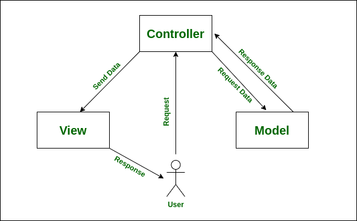

# Laporan Modul 1: Perkenalan Laravel
**Mata Kuliah:** Workshop Web Lanjut  
**Nama:** M. Iqbal Sayuti  
**NIM:** 2024573010057  
**Kelas:** TI-2C  

---

## Abstrak 
Laporan ini membahas dasar-dasar penggunaan Laravel sebagai framework PHP yang menerapkan arsitektur MVC (Model–View–Controller). Pembahasan mencakup pengenalan, struktur folder, fungsi file penting, hingga kelebihan dan kekurangan Laravel dalam pengembangan aplikasi web. Tujuan membuat laporan ini adalah agar bisa lebih paham dengan framework laravel yg sedang saya pelajari ini.

---

## 1. Pendahuluan
- Tuliskan teori perkenalan tentang laravel  
    Laravel adalah framework PHP open-source yang menggunakan pola arsitektur MVC (Model–View–Controller).
    Dikembangkan oleh Taylor Otwell pada tahun 2011, Laravel hadir untuk membantu developer membangun aplikasi web dengan struktur rapi, sintaks elegan, dan fitur lengkap.
- Apa itu Laravel?  
    Laravel adalah framework PHP open-source yang menggunakan arsitektur MVC (Model-View-Controller).
    Diciptakan oleh Taylor Otwell (2011), Laravel bertujuan untuk membuat pengembangan aplikasi web lebih cepat, aman, dan terstruktur.
- Karakteristik utama (MVC, opinionated, dsb.)  
    - Menggunakan model MVC
        MVC merupakan satu fitur yang juga sangat membantu pada saat pengembangan website. Dengan begitu website yang dihasilkan memiliki file yang tersusun dengan rapi. Hal ini akan mempermudah proses pengembangan website tersebut.
    - Tool artisan  
        Tool artisan merupakan salah satu keunggulan Laravel yang disukai penggunanya. Tool ini berfungsi agar website yang sedang dikembangkan dapat berinteraksi dengan framework lainnya dengan bantuan command line. Adanya tool ini membuat para pengembang menjadi lebih mudah dalam melakukan kegiatan antar framework tanpa hambatan.
- Untuk jenis aplikasi apa Laravel cocok?  
    Aplikasi Web Skala Menengah hingga Besar (company profile, sistem informasi, e-commerce, CMS).
    Proyek Startup/Enterprise → karena cepat dikembangkan dan mudah di-maintain.
    Aplikasi yang membutuhkan keamanan (login, role management, proteksi data).
    Aplikasi dengan kebutuhan kompleks (multi-user, dashboard admin, payment gateway, dll.).

---

## 2. Komponen Utama Laravel (ringkas)
Tuliskan penjelasan singkat (1–3 kalimat) untuk tiap komponen berikut:
- Blade (templating)
    Sistem ini mempermudah pembuatan halaman web dengan menyediakan syntax ekspresif dan fitur-fitur seperti pewarisan template atau pembuatan bagian.
- Eloquent (ORM)
    Eloquent ORM (Object-Relational Mapping) adalah sistem bawaan Laravel untuk berinteraksi dengan database menggunakan metode yang didasarkan pada objek (object-oriented).
- Routing
    Dengan fitur yang satu ini, kamu dapat membuat aplikasi yang dengan lebih mudah. Hal ini karena dalam framework ini, semua request akan dipetakan dengan menggunakan bantuan rute. Kamu bisa memberikan nama routing, mengelompokan, memfilter routing yang ada sesuai kebutuhan kamu.
- Controllers
    Bertindak sebagai penghubung antara model dan view, memproses input pengguna, lalu menampilkan respons.
- Migrations & Seeders
    migration menyediakan sistem kontrol versi untuk struktur database. Dengan fitur ini, Anda bisa mendokumentasikan dan membagikan perubahan database dengan mudah.
    seeders, Dengan fitur ini, developer bisa menghemat waktu, meningkatkan produktivitas, dan meminimalkan risiko error manual selama pengembangan.
- Artisan CLI
    Artisan CLI adalah command-line interface Laravel yang digunakan untuk mengotomatiskan tugas-tugas berulang serta menyediakan alur kerja pengembangan yang konsisten.
- Testing (PHPUnit)
    Dalam Laravel sudah disediakan fitur untuk testing dan debugging sebuah website. Kamu tidak perlu khawatir lagi untuk melakukan testing dan debugging.
(Tambahkan komponen lain jika ingin)

---

## 3. Berikan penjelasan untuk setiap folder dan files yang ada didalam struktur sebuah project laravel.
- Folder app/ ⇒ Tempat logika utama aplikasi pada Laravel disimpan. Semua kode inti, seperti controller, model, dan service, ada di sini.
    - Http/Controllers/ ⇒ Berisi Controller yang bertugas untuk mengatur alur aplikasi.
        - Controller.php → File dasar untuk semua controller.
    - Models/ ⇒ Berisi Model untuk merepresentasikan tabel di database.
        - User.php → Model bawaan untuk tabel users.
    - Providers/ ⇒ Berisi Service Provider, yang bertugas menyiapkan layanan dan konfigurasi ketika aplikasi dijalankan.
        - AppServiceProvider.php ⇒ service provider default di Laravel yang fungsinya untuk menaruh konfigurasi atau kode inisialisasi global.

- Folder bootstrap/ ⇒ berfungsi untuk menyiapkan dan menjalankan Laravel sebelum aplikasi dijalankan. Di dalamnya ada file penting dan folder cache.
    - cache/ ⇒ Menyimpan hasil cache agar performa lebih cepat.
    - app.php → starter utama aplikasi Laravel, dengan membuat instance Laravel.
    - providers.php → Daftar service provider hasil cache untuk mempercepat load.

- Folder config/ ⇒ adalah pusat pengaturan Laravel. Kamu bisa mengatur cara aplikasi berjalan, mulai dari database, autentikasi, cache, sampai email ada disini.
    - app.php → konfigurasi utama aplikasi (nama app, timezone, locale, service providers, alias class).
    - auth.php → pengaturan sistem autentikasi (guard, provider user, reset password).
    - cache.php → konfigurasi caching (driver cache seperti file, database, redis, memcached).
    - database.php → konfigurasi koneksi database (MySQL, PostgreSQL, SQLite, SQL Server, dsb).
    - filesystem.php → pengaturan file storage (lokal, public, cloud seperti S3).
    - logging.php → konfn mail (SMTP, Mailgun, Postmark, driver, host, port).
    - queue.php → konfigurasi job queue (driver queue: database, redis, beanstalkd, sync).
    - services.php → tempat menyimpan konfigurasi kredensial layanan eksternal (misalnya Mailgun, AWS, Google, GitHub OAuth).
    - session.php → konfigurasi session aplikasi (driver session: file, cookie, database, redis, lama waktu session).

- Folder Database/ ⇒ digunakan untuk mengelola struktur database, data contoh, dan testing data di Laravel.
    - factories/ ⇒ Digunakan untuk membuat data palsu (dummy) atau testing.
    - migrations/ ⇒ Skrip untuk mengelola struktur database (seperti pembuatan, perubahan, atau penghapusan tabel) menggunakan kode, bukan query SQL langsung.
        - 0001_01_01_000000_create_users_table.php → Membuat tabel users.
        - 0001_01_01_000001_create_cache_table.php → Membuat tabel untuk cache.
        - 0001_01_01_000002_create_jobs_table.php → Membuat tabel untuk antrian (queue jobs).
    - seeders/ ⇒ Folder untuk mengisi data awal ke database.

- Folder Public/ ⇒ berisi semua file yang bisa diakses langsung oleh user pada aplikasi.
    - .htaccess → File konfigurasi untuk Apache server.
    - favicon.ico → Untuk menampilkan Ikon kecil di browser.
    - index.php → File yang digunakan sebagai pintu masuk semua request dari user ke Laravel.
    - robots.txt → File yang digunakan untuk Mengatur instruksi kepada search engine, halaman mana yang boleh diindeks atau tidak oleh Google, dll.

- Folder Resources/ ⇒ digunakan untuk menyimpan file sumber daya (assets) dan template tampilan (view) sebelum dikompilasi atau digunakan. Semua file di sini biasanya diproses sebelum dipindahkan ke folder public.
    - css/ ⇒ Berisi file CSS untuk styling tampilan aplikasi.
    - js/ ⇒ Berisi file JavaScript untuk interaksi dan logika front-end.
    - views/ ⇒ Berisi file tampilan (view) menggunakan Blade template engine.
        - welcome.blade.php → Tampilan default Laravel yang muncul ketika kamu pertama kali menginstall Laravel.

- Folder Routes/ ⇒ berisi file untuk mengatur URL aplikasi dan menentukan apa yang dilakukan Laravel ketika URL tersebut diakses (routing).
    - api.php → Berisi rute untuk API.
    - console.php → Rute untuk perintah Artisan (command di terminal).
    - web.php → Berisi rute untuk halaman web.

- Folder Storage/ ⇒ digunakan untuk menyimpan file yang dihasilkan oleh aplikasi Laravel, seperti cache, log, file sementara, dan file yang di-upload.
    - app/ ⇒ Menyimpan file aplikasi yang bersifat privat (tidak bisa diakses langsung oleh publik).
        - private/ ⇒ File privat yang hanya digunakan secara internal.
        - public/ ⇒ File yang bisa diakses publik.
        - .gitignore → Digunakan untuk mengabaikan file tertentu agar tidak ikut masuk ke Git repository.
    - framework ⇒ adalah folder di Laravel yang dipakai untuk menyimpan file sementara (temporary files) yang dibutuhkan framework saat berjalan.
        - cache/ → file cache aplikasi.
        - sessions/ → data session user (kalau driver session = file).
        - testing/ → file sementara saat menjalankan testing.
        - views/ → hasil kompilasi Blade template (.blade.php jadi PHP).
    - logs/ ⇒ Tempat menyimpan log error dan aktivitas.

- Folder Tests/ ⇒ berisi semua file testing di Laravel. Folder ini digunakan untuk menulis dan menjalankan tes otomatis agar memastikan fitur aplikasi berjalan sesuai harapan.
    - Feature/ ⇒ Folder untuk memeriksa alur kerja atau fitur kode secara keseluruhan.
        - ExampleTest.php → File contoh bawaan Laravel untuk memperlihatkan cara membuat pengujian unit.. (dapat dihapus sesuai kebutuhan)
    - Unit/ ⇒ Folder pengujian unit test yang memeriksa bagian kecil kode secara spesifik.
    - pest.php → file bootstrap untuk testing dengan Pest di Laravel.
    - TestCase.php → Kelas dasar (base class) yang digunakan untuk semua pengujian.

- vendor/ ⇒ Menyimpan semua library dan package pihak ketiga yang di-install melalui Composer.
- .editorconfig → mengatur standar format kode agar konsisten di semua editor.
- .env → Tempat menyimpan konfigurasi environment (misalnya database, mail, API key) yang spesifik untuk server atau lokal.
- .env.example → Contoh template dari file .env agar developer lain tahu variabel apa saja yang harus disiapkan.
- .gitattributes → Mengatur bagaimana Git menangani file dalam repo (misalnya end-of-line, merge).
- .gitignore → Menentukan file/folder yang tidak perlu dimasukkan ke Git (contoh: vendor/, .env).
- artisan → File berisi Command-line interface yang menyediakan perintah untuk membantu dalam pengembangan aplikasi Laravel.
- composer.json → File konfigurasi Composer.
- composer.lock → menyimpan versi pasti dari dependency PHP yang digunakan.
- package.json → File konfigurasi untuk npm/yarn.
- phpunit.xml → konfigurasi utama untuk menjalankan testing PHPUnit.
- README.md → Dokumentasi proyek (biasanya berisi cara instalasi & penggunaan).
- vite.config.js →Konfigurasi Vite, tool untuk meng-compile dan mengoptimasi asset frontend (CSS, JS).
---

## 4. Diagram MVC dan Cara kerjanya

> Letakkan gambar di dalam folder `laporan1/gambar/`. Kemudian masukkan gambar tersebut ke laporan.

lihat cara nya disini https://www.ulas.in/komputer/markdown-memasukkan-gambar/  

- Cara kerja MVC :
    1. User mengakses aplikasi (contoh: buka URL /produk).
    2. Request masuk → Route mengarahkannya ke Controller terkait.
    3. Controller minta data ke Model (misalnya daftar produk dari database).
    4. Model mengambil data dari database lalu mengembalikan ke Controller.
    5. Controller meneruskan data tersebut ke View.
    6. View menampilkan data dengan format yang ramah pengguna (HTML, JSON, dll).

---

## 6. Kelebihan & Kekurangan (refleksi singkat)
- Kelebihan Laravel menurut Anda
    - Laravel itu sangat terstruktur karena sintaksnya rapi dan dokumentasinya lengkap banget, jadi lebih gampang dipelajari dibanding framework lain. Fitur-fiturnya juga udah “siap pakai” — dari autentikasi, routing, sampai ORM.
- Hal yang mungkin menjadi tantangan bagi pemula
    - biasanya memahami pola MVC dan gimana tiap bagian (Model, View, Controller) saling terhubung. Selain itu, banyaknya fitur bawaan kayak migration, Eloquent, middleware, sampai service container bisa sangat membingungkan di awal. Pemula juga kadang bingung ngatur konfigurasi environment (.env) dan dependency lewat Composer karena butuh terbiasa dulu.
---

## 7. Referensi
Cantumkan sumber yang Anda baca (buku, artikel, dokumentasi) — minimal 2 sumber. Gunakan format sederhana (judul — URL).
- 
- Apa itu Laravel? Pengertian, Fitur dan Kelebihannya — https://www.dewaweb.com/blog/apa-itu-laravel/
- Apa itu Laravel: fitur utama, contoh penggunaan, dan kelebihannya — https://www.hostinger.com/id/tutorial/apa-itu-laravel#Artisan_CLI
- Penjelasan Struktur Folder Laravel untuk Pemula 2025 - https://blog.nawatara.com/penjelasan-struktur-folder-laravel-untuk-pemula-2025/

---
