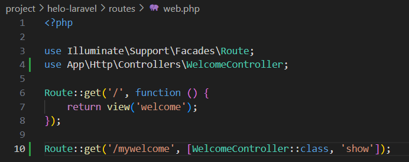
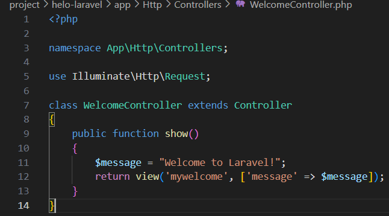
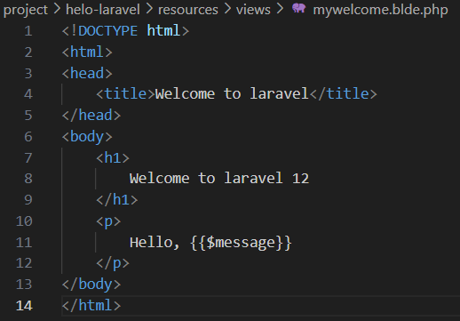
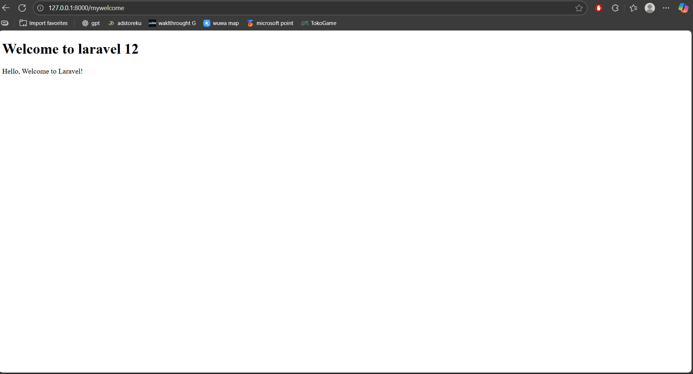
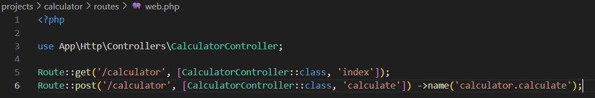
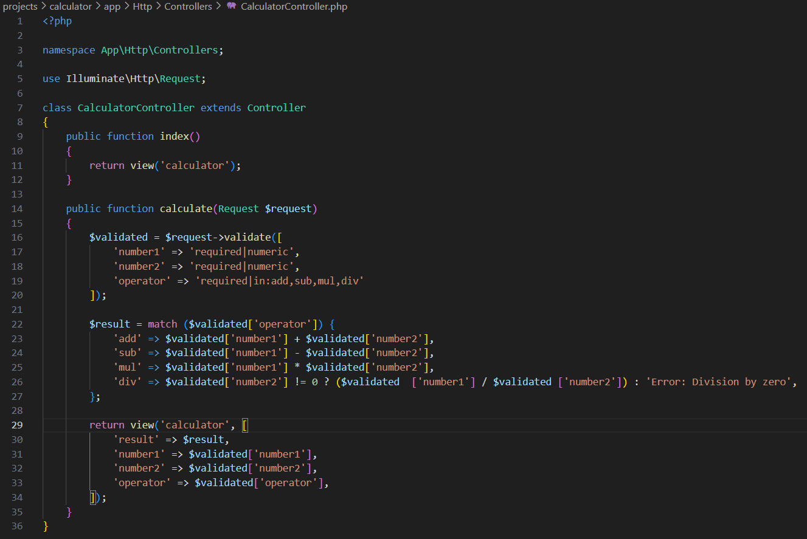
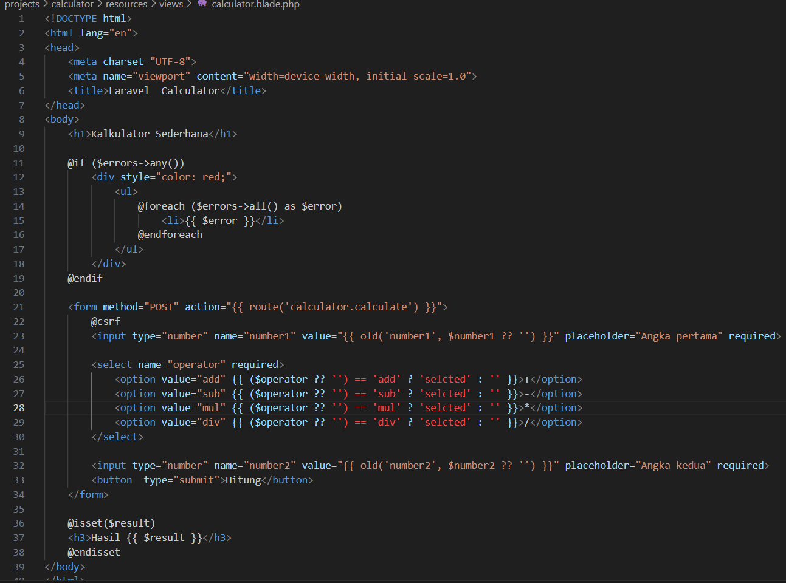
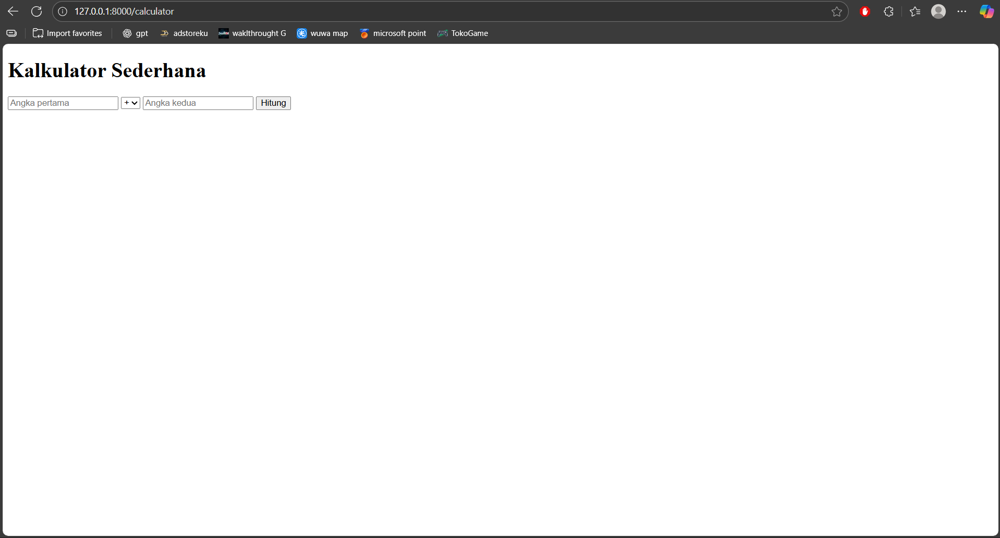

# Laporan Modul 2: Laravel Fundamentasl
**Mata Kuliah:** Workshop Web Lanjut   
**Nama:** M. Iqbal Sayuti  
**NIM:** 2024573010057  
**Kelas:** TI-2C  

---

## Abstrak 
Tuliskan ringkasan singkat tentang isi laporan ini dan tujuan Anda membuat laporan.
    - Praktikum ini bertujuan untuk mempelajari fundamental Laravel, termasuk konsep MVC (Model, View, Controller), routing, middleware, request dan response, serta penggunaan Blade Templating Engine dalam pembuatan tampilan web. Praktikum dilakukan dengan membuat aplikasi sederhana, mulai dari menambahkan route, membuat controller, hingga menampilkan view. Hasil praktikum menunjukkan bahwa Laravel memudahkan pengembangan aplikasi web yang terstruktur, efisien, dan mudah dipelihara, serta mendukung validasi input secara otomatis.

---

## 1. Dasar Teori
- Apa itu MVC (Model, View, Controller).
    - MVC adalah sebuah pola arsitektur dalam membuat sebuah aplikasi dengan cara memisahkan kode menjadi tiga bagian yang terdiri dari Model, View, Controller
- Konsep Routing di Laravel.
    - Routing di Laravel adalah mekanisme untuk menentukan bagaimana aplikasi merespons sebuah request (misalnya akses URL).
    - Semua route biasanya didefinisikan di folder routes/, terutama pada file web.php (untuk web) dan api.php (untuk API).
    - Route bisa diarahkan ke closure, controller, atau bahkan view langsung.
    - Laravel mendukung berbagai metode HTTP seperti GET, POST, PUT, DELETE, serta grouping (middleware, prefix, namespace).
- Fungsi Middleware.
    - Middleware menyediakan mekanisme untuk memfilter permintaan HTTP yang masuk ke aplikasi Anda. Middleware bertindak sebagai lapisan yang berada di antara siklus request dan response.
- Bagaimana cara Laravel menangani Request dan Response.
    - Laravel menyediakan cara sederhana untuk mengembalikan response. Kita dapat mengembalikan string, view, JSON, atau bahkan file download, Routing di Laravel mendefinisikan bagaimana aplikasi merespons permintaan (request) yang masuk. Routing memetakan URI ke aksi controller atau closure. Route di Laravel didefinisikan di file routes/web.php untuk permintaan web dan di routes/api.php untuk route API.
- Peran Controller dan View.
    - Controller : Bagian yang bertugas untuk menghubungkan serta mengatur model dan view agar dapat saling terhubung.
    - View : Bagian yang bertugas untuk menampilkan informasi dalam bentuk Graphical User Interface (GUI).
- Fungsi Blade Templating Engine.
    - membuat tampilan web yang bersih, efisien, sederhana dan mudah dipelihara.
---

## 2. Langkah-Langkah Praktikum
Tuliskan langkah-langkah yang sudah dilakukan, sertakan potongan kode dan screenshot hasil.

2.1 Praktikum 1 – Route, Controller, dan Blade View

- Tambahkan route pada routes/web.php.
    - 
- Buat controller WelcomeController.
    -  
- Buat view mywelcome.blade.php.
    - 
- Jalankan aplikasi dan tunjukkan hasil di browser.

Screenshot Hasil:

2.2 Praktikum 2 – Membuat Aplikasi Sederhana "Calculator"

- Tambahkan route untuk kalkulator.
    - 
- Buat controller CalculatorController.
    - 
- Tambahkan view calculator.blade.php.
    - 
- Jalankan aplikasi dan coba dengan beberapa input berbeda.

Screenshot Hasil:

---

## 3. Hasil dan Pembahasan
Jelaskan apa hasil dari praktikum yang dilakukan.
- Apakah aplikasi berjalan sesuai harapan?
    - ya, aplikasi berjalan sesuai code yang telah diketikkan
- Apa yang terjadi jika ada input yang salah (misalnya pembagian dengan 0)?
    - akan menampilkan "Hasil Error: Division by zero"
- Bagaimana validasi input bekerja di Laravel?
    - Validasi input di Laravel bekerja dengan mengecek data request terhadap aturan (rules) yang ditentukan. Jika valid, data diproses; jika gagal, Laravel otomatis mengembalikan error ke user (biasanya redirect dengan pesan error).
- Apa peran masing-masing komponen (Route, Controller, View) dalam program yang dibuat?
    - Route : Route di Laravel didefinisikan di file routes/web.php untuk permintaan web dan di routes/api.php untuk route API.
    - Controller : Bagian yang bertugas untuk menghubungkan serta mengatur model dan view agar dapat saling terhubung.
    - View : Bagian yang bertugas untuk menampilkan informasi dalam bentuk Graphical User Interface (GUI).
---

## 4. Kesimpulan

Tulis kesimpulan dari praktikum ini

Laravel memudahkan pembuatan aplikasi web dengan menerapkan konsep MVC (Model, View, Controller) yang memisahkan logika, tampilan, dan data. Route berfungsi untuk menangani request dari pengguna, Controller memproses logika aplikasi, dan View menampilkan informasi secara interaktif. Penggunaan Blade Templating Engine membuat pembuatan tampilan menjadi lebih rapi, efisien, dan mudah dipelihara.
---

## 5. Referensi
Cantumkan sumber yang Anda baca (buku, artikel, dokumentasi) — minimal 2 sumber. Gunakan format sederhana (judul — URL).
- Apa Itu MVC? Pahami Konsepnya dengan Baik — https://www.dicoding.com/blog/apa-itu-mvc-pahami-konsepnya/
- Modul 2 - Laravel Fundamentals — https://hackmd.io/@mohdrzu/B1zwKEK5xe#Praktikum-1---Route-Controller-dan-Blade-View
---