# Laporan Modul 3: Laravel Controller
**Mata Kuliah:** Workshop Web Lanjut   
**Nama:** M. Iqbal Sayuti     
**NIM:** 2024573010057  
**Kelas:** TI-2C

---

## Abstrak 

Laporan ini membahas penerapan Controller pada framework Laravel 12 dalam arsitektur Model-View-Controller (MVC). Tujuan praktikum ini adalah untuk memahami fungsi controller sebagai penghubung antara model dan view, sekaligus bagaimana controller mengelola logika aplikasi, memproses permintaan pengguna, dan mengembalikan respons yang sesuai. Melalui tiga percobaan, yaitu penanganan request dan response, penggunaan route grouping, serta penerapan prefix dan namespace, mahasiswa diharapkan dapat membangun struktur aplikasi web yang lebih teratur, efisien, dan mudah dikembangkan. Hasil akhir menunjukkan bahwa controller memiliki peran penting dalam mengatur alur data dan tampilan aplikasi secara sistematis di Laravel.

---
## 1. Dasar Teori
1. Apa Itu Controller
Dalam pola MVC (Model-View-Controller), sebuah controller bertindak sebagai jembatan antara model dan view. Controller menangani input pengguna, berinteraksi dengan model untuk data, dan mengembalikan respons yang benar, yang seringkali merender sebuah view.
2. Jelaskan fungsi utama Controller dalam arsitektur MVC pada Laravel.
Controller dalam arsitektur MVC (Model-View-Controller) pada Laravel berfungsi sebagai penghubung antara Model dan View. Controller menerima permintaan (request) dari pengguna melalui route, lalu mengolah data yang dibutuhkan dengan memanggil Model, dan akhirnya mengirimkan hasilnya ke View untuk ditampilkan.
- Sebutkan dan jelaskan tiga jenis controller yang ada di Laravel.
1. Basic Controllers (Controller Dasar)
2. Resource Controllers (Controller Sumber Daya)
3. Invokable Controllers (Controller yang Dapat Dipanggil)
--- 

## 2. Langkah-Langkah Praktikum
Tuliskan langkah-langkah yang sudah dilakukan, sertakan potongan kode dan screenshot hasil.

2.1 Praktikum 1 – Menangani Request dan Response View di laravel 12

- Langkah 1 : Buat Dan Buka Proyek Laravel
composer create-project laravel/laravel:^12.0.3 lab-view
cd lab-view
code .

- Langkah 2: Buat sebuah Controller
php artisan make:controller DemoController
Kemudian isi dengan kode berikut:
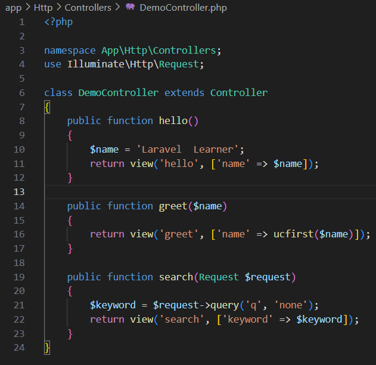 

- Langkah 3: Definisikan Rute
Edit routes/web.php:
Kemudian Isi Dengan Code Berikut
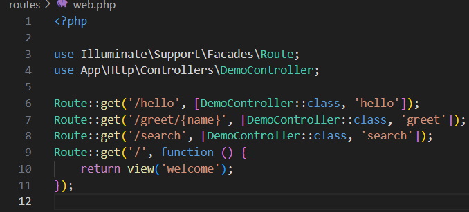
- Langkah 4: Buat View Sederhana
Buat file Blade berikut di resources/views/:
Hello.blade.php
Greet.blade.php
Search.blade.php

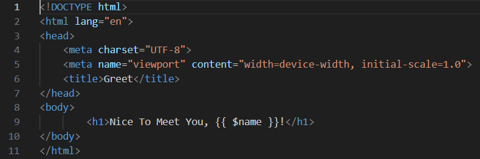
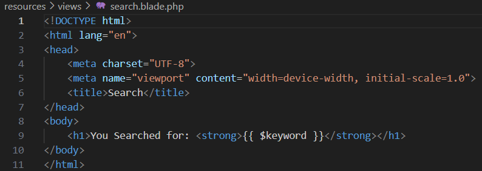
Screenshot Hasil:
- Hasil Hello.blade.php
 
- Hasil Greet.blade.php

- Hasil Search.blade.php

2.2 Praktikum 2 – Menggunakan Group Route
- Langkah 1 : Buat Dan Buka Proyek Laravel'
composer create-project laravel/laravel:^12.0.3 lab-group
cd lab-group
code .

- Langkah 2 : Buat Sebuah Controller
php artisan make:controller PageController
Kemudian Isi Dengan Code Berikut :
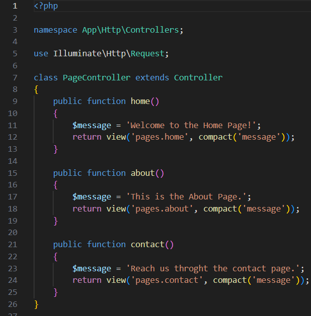 

- Langkah 3 : Definisikan Rute Yang Dikelompokan
Kemudian Isi Dengan Code Berikut :
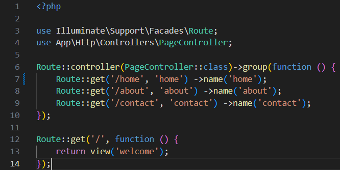  

- Langkah 4 : Buat View Sederhana
-Buat Folder : resources/views/pages/
-Selanjutnya Buat File - Filr Berikut Di dalam Pages/

1. Home.blade.php
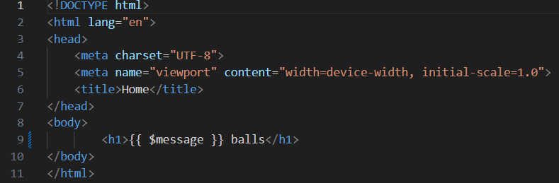 
2. about.blade.php
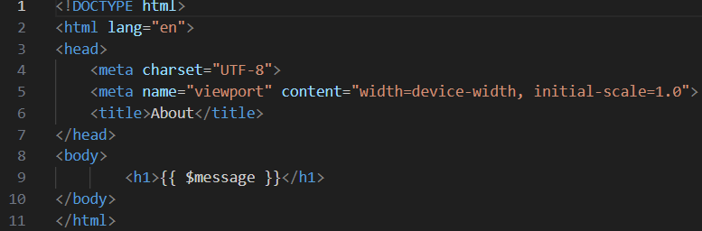 
3.contact.blade.php
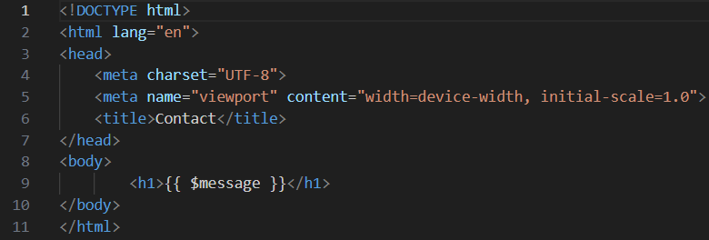 

Screenshot Hasil:
HasilHome
 

HasilAbout
 

HasilContact
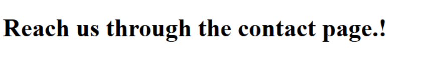

2.3 Praktikum 3 – Pengelompokan Prefix Dengan NameSpace Rute Di Laravel 12

Langkah 1: Buar Dan Buka Proyek Laravel
composer create-project laravel/laravel:^12.0.3 lab-prefix
cd lab-prefix
code .

Langkah 2: Buat Controller Dengan NameSpace
- php artisan make:controller Admin/DashboardController
- php artisan make:controller Admin/UserController

Langkah 3: Definisikan Kelompok Rute Dengan Prefix Dan NameSpace Controller
Kemudian Isi Dengan Code Berikut          
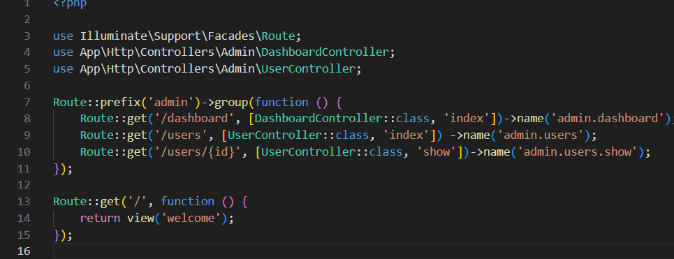 

Langkah 4: Tambahkan Aksi Ke Controller
Kemudian Isi Dengan Code Berikut Untuk DashboardController.php
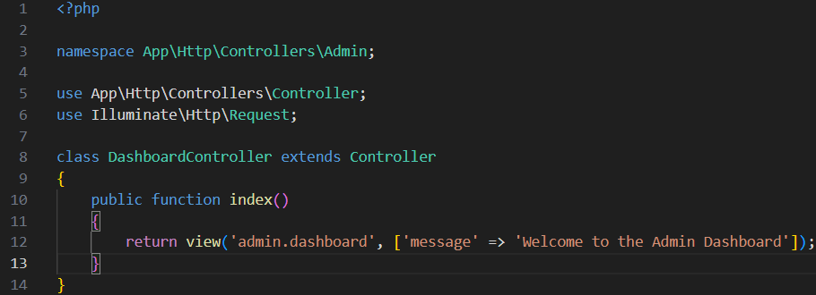
Selanjutnya Isi Code Berikut Untuk UsersController.php
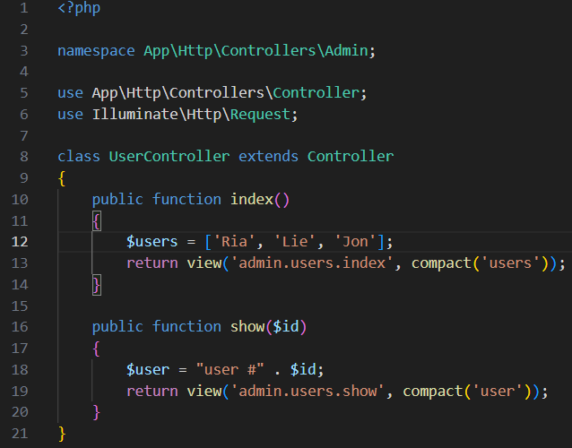

Langkah 5: 
Buat View Sederhana
Buat folder dan file di bawah resources/views/admin/. Kemudian, buat file-file berikut:
- dashboard.blade.php
- users/index.blade.php

Isi Code Berikut pada Dashboard.blade.php
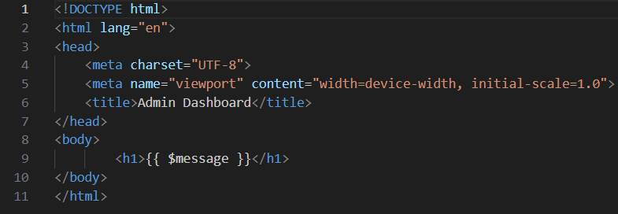

Selanjutnya membuat folder users di bawah resources/views/admin/ dan buat file index.blade.php di dalamnya. View users/index.blade.php adalah file HTML sederhana yang menampilkan daftar pengguna:
Kemudian Isi Dengan code berikut
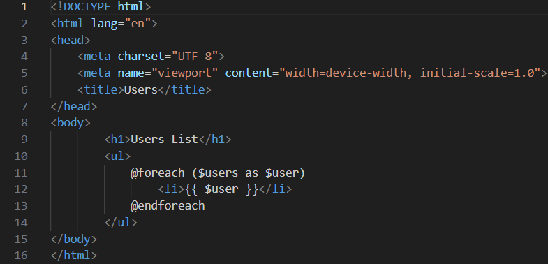

Selanjutnya Bikin Show.blade.php
isi dengan code berikut
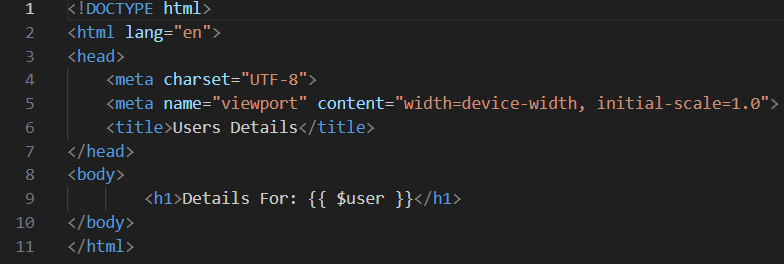

Screenshot Hasil:

- Hasil Admin Dashboard  
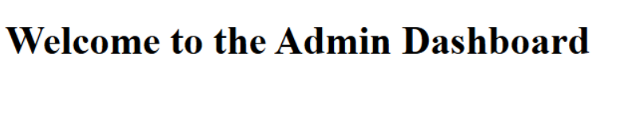

- Hasil Admin Users  
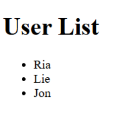

- Hasil Users Detail  
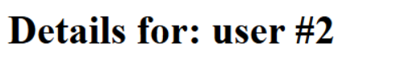

---

## 3. Hasil dan Pembahasan
Jelaskan apa hasil dari praktikum yang dilakukan.
Dalam praktikum ini telah dibuat beberapa controller di Laravel untuk menangani request dan menampilkan view.

- Praktikum 1 DemoController berhasil menampilkan halaman hello, greet, dan search sesuai dengan route yang telah ditentukan.
- Praktikum 2 Dengan penerapan Route Group menggunakan PageController, halaman home, about, dan contact dapat ditampilkan dengan baik, serta struktur route menjadi lebih teratur.
- Praktikum 3 Implementasi prefix dan namespace berhasil memisahkan area admin (melalui DashboardController dan UserController) dari area pengguna biasa, dengan hasil tampilan dashboard dan daftar user yang sesuai.

Secara keseluruhan,controlle berperan penting dalam menghubungkan route, logika aplikasi, dan tampilan agar sistem berjalan secara terstruktur dan efisien.

---
## 4. Kesimpulan

Pada bab ini, kita telah membahas dasar-dasar controller di Laravel 12, mulai dari cara membuat controller, mendefinisikan rute, hingga meneruskan data ke view. Kita juga mempelajari berbagai jenis controller seperti resource controller dan invokable controller, serta cara mengelompokkan rute agar struktur aplikasi lebih terorganisir.

Selain itu, dibahas pula bagaimana menangani permintaan, melakukan validasi input, dan mengembalikan berbagai jenis respons. Sebagai penerapan, dilakukan praktikum untuk memperkuat pemahaman dengan membangun aplikasi web sederhana yang menampilkan penerapan penanganan permintaan dan pengelompokan rute.

Bab ini menjadi landasan penting untuk memahami cara kerja controller di Laravel, yang akan menjadi dasar bagi pembahasan topik-topik lanjutan pada bab berikutnya.

---
## 5. Referensi
- https://hackmd.io/@mohdrzu/H1sB73dnxg
- chatgpt.com

---