# Laporan Modul 5: Form Submission & Data Validation

**Mata Kuliah:** Workshop Web Lanjut  
**Nama:** M. Iqbal Sayuti  
**NIM:** 2024573010057  
**Kelas:** TI-2C  

---

## Abstrak

Dalam praktikum ini, mahasiswa mempelajari tentang proses form submission dan data validation dalam pengembangan aplikasi berbasis web. Tujuan utama dari praktikum adalah memahami cara mengirimkan data dari pengguna melalui form serta memastikan data yang dikirim memenuhi kriteria yang telah ditentukan sebelum diproses lebih lanjut. Pada percobaan ini, dilakukan implementasi form dengan berbagai jenis input seperti teks, angka, dan email, kemudian dilakukan validasi baik di sisi klien (client-side validation) menggunakan JavaScript maupun di sisi server (server-side validation) menggunakan bahasa pemrograman tertentu seperti PHP. Hasil dari praktikum menunjukkan bahwa penerapan validasi data sangat penting untuk menjaga keamanan, mencegah kesalahan input, serta meningkatkan keandalan sistem. Dengan demikian, mahasiswa diharapkan mampu merancang form yang interaktif, aman, dan efisien dalam proses pengiriman data.

---

## 1. Dasar Teori

### **Dasar Teori**

Dalam pengembangan aplikasi web, form digunakan sebagai sarana untuk mengumpulkan data dari pengguna dan mengirimkannya ke server melalui mekanisme *request–response*. Agar sistem berjalan aman dan andal, setiap data yang dikirim perlu divalidasi serta dilindungi dari serangan seperti CSRF. Proses validasi juga disertai aturan dan penanganan kesalahan agar pengguna mendapatkan umpan balik yang jelas dan tepat.

1. Arsitektur Request–Response = Pola komunikasi di mana client mengirim *request* dan server membalas dengan *response* berupa hasil atau halaman.
2. Form Submission = Proses pengiriman data dari form ke server menggunakan metode GET atau POST.
3. Data Validation = Pemeriksaan data agar sesuai format dan aturan yang ditentukan sebelum diproses.
4. Validation Rules = Aturan seperti `required`, `email`, `numeric`, `min`, dan `max` yang menentukan validitas input.
5. Client-Side Validation = Validasi di sisi pengguna menggunakan HTML5 atau JavaScript untuk memberi umpan balik cepat.
6. Server-Side Validation = Validasi di sisi server menggunakan bahasa pemrograman agar lebih aman.
7. CSRF Protection = Perlindungan dari serangan *Cross-Site Request Forgery* dengan penggunaan token unik di setiap form.
8. Error Handling dan Display = Menangani serta menampilkan pesan kesalahan agar pengguna mengetahui input yang perlu diperbaiki.
9. Keamanan Data = Validasi dan perlindungan input mencegah serangan seperti *SQL Injection* dan *XSS*.

---

## 2. Langkah-Langkah Praktikum

Praktikum 1: Menangani Request dan Response View di Laravel 12

- Langkah 1: Buat dan Buka Proyek laravel  
  laravel new form-app  
  cd form-app  
  code .

- Langkah 2: Definisikan Rute
  Buka Routes/Web.php Dan isi dengan code berikut
  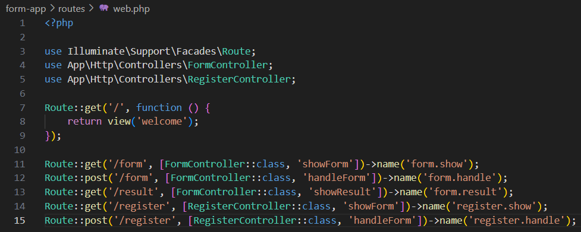

- Langkah 3: Buat Sebuah Controller  
  php artisan make:controller FormConntroller  
  ini akan membuat app/Http/Controllers/FormController.php.

- Langkah 4: Buat Blade View :
    - Buat File Baru di Direktori resources/views/form.blade.php :  
        Isi Dengan Code Berikut
        
    - Buat File Baru di Direktori resources/views/result.blade.php :  
        Isi Dengan Code Berikut
        

- Langkah 5: Uji Rute  
  Mulai Php Artisan serve  
  Buka Browser Dan Kunjungi  
  http://127.0.0.1:8000/form & http://127.0.0.1:8000/result
  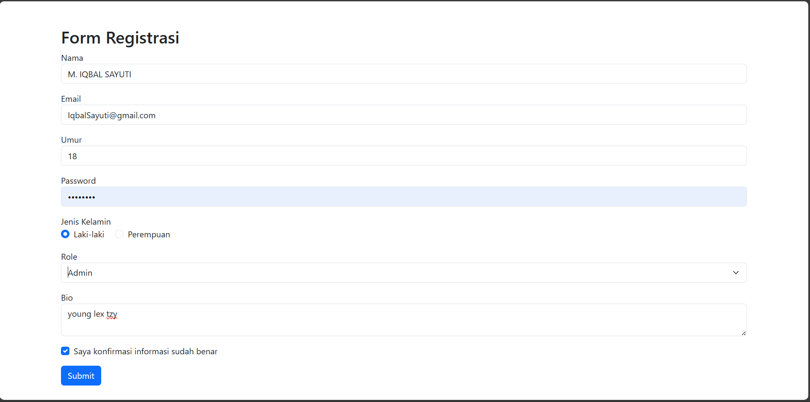
  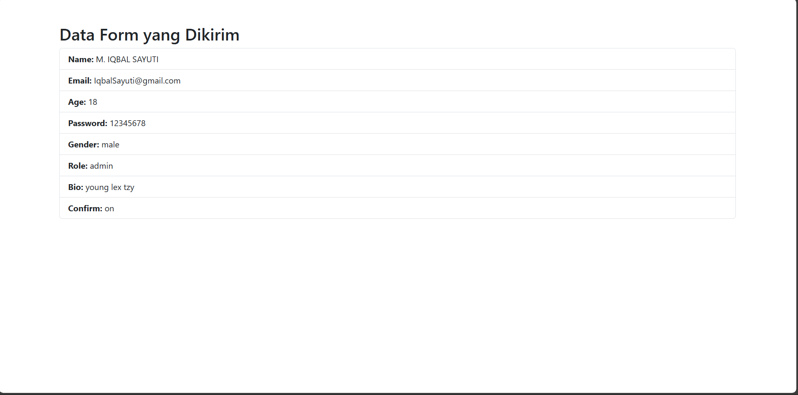

Praktikum 2: Validasi Kustom dan Pesan Error di Laravel 12

- Langkah 1: Tambahkan route baru  
  Buka routes/web.php dan tambahkan:
        

- Langkah 2: Buat Sebuah Controller   
  php artisan make:controller RegisterConntroller  
  ini akan membuat app/Http/Controllers/RegisterController.php.

- Langkah 3: Tambahkan Logika Di Controller  
  Kemudian, isi dengan code berikut  
  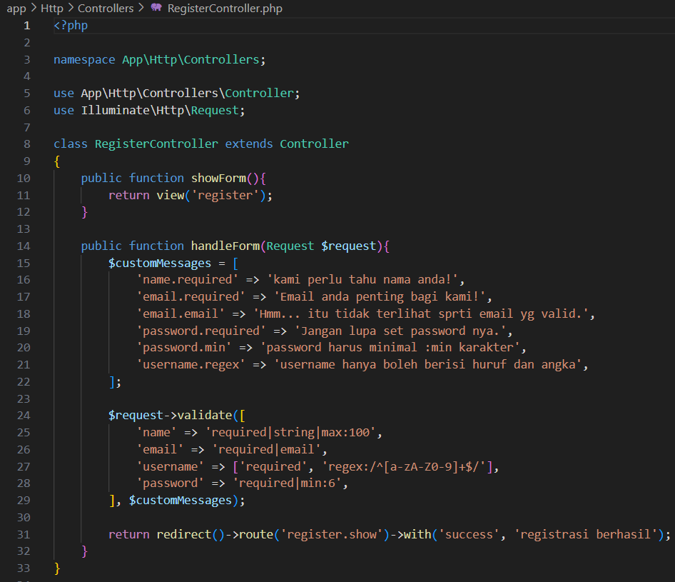   

- Langkah 4: Buat Blade View  
  Buat file view Di direktori resources/views/Register.blade.php :  
  Kemudian Isi Dengan Code Berikut
  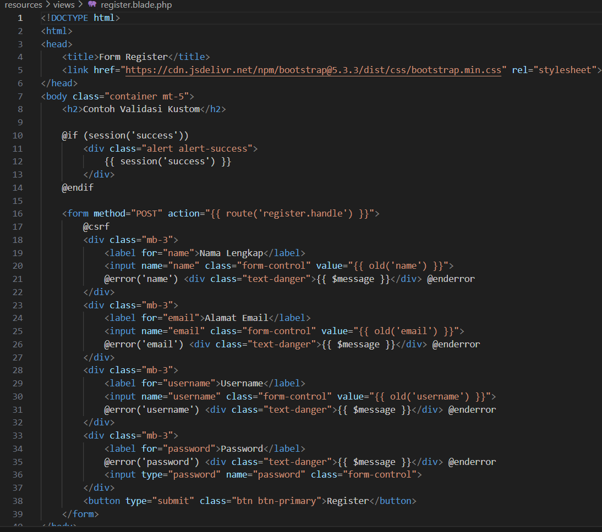   

- Langkah 5: Jalankan Aplikasi  
  Jalankan Server Pengembangan  
  php php artisan serve  
  Akses aplikasi di:  
  http://127.0.0.1:8000/register 
  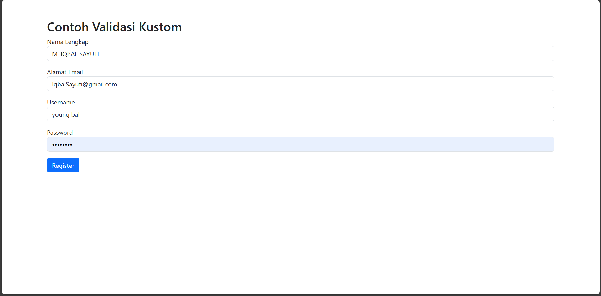

Praktikum 3: Multi-Step Form Submission dengan Session Data  

- Langkah 1: Buat dan Buka Proyek laravel  
  laravel new multistep-form-app  
  cd multistep-form-app  
  code .

- Langkah 2: Buat layout dasar  
  Buat direktori layouts di resources/views  
  Kemudian, buat resources/views/admin/app.blade.php:  
  Dan Isi dengan Code Berikut:  
   

- Langkah 3: Definisikan Route  
  buka route/web.php dan isi:  
  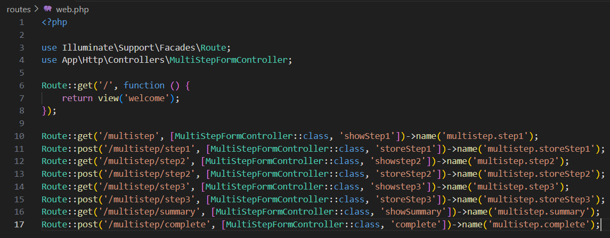

- Langkah 4: Buat Sebuah Controller  
  php artisan make:controller MultiStepFormConntroller  
  ini akan membuat app/Http/Controllers/MultiStepFormController.php   
  dan isikan file nya dengan :  
  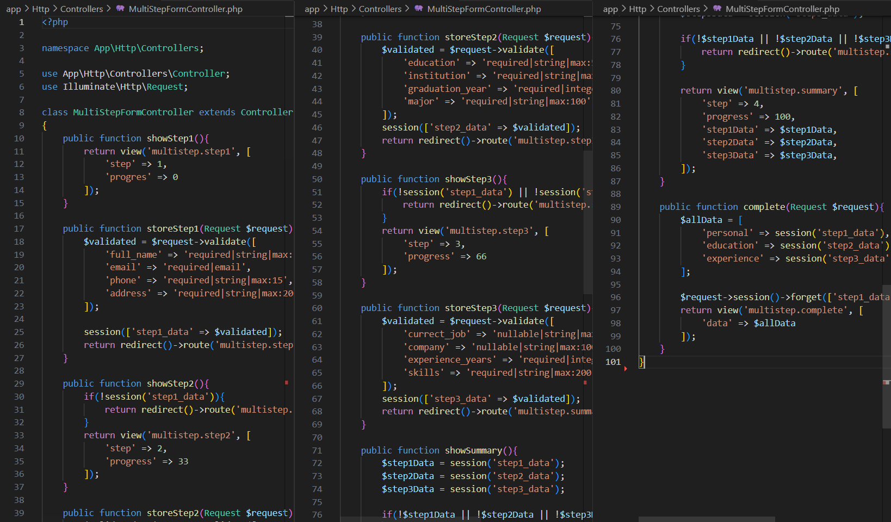
    
- Langkah 4: Buat View untuk setiap step  
  Buat direktori resources/views/multistep/  
  - Step 1 : informasi pribadi (resources/views/multistep/step1.blade.php)
    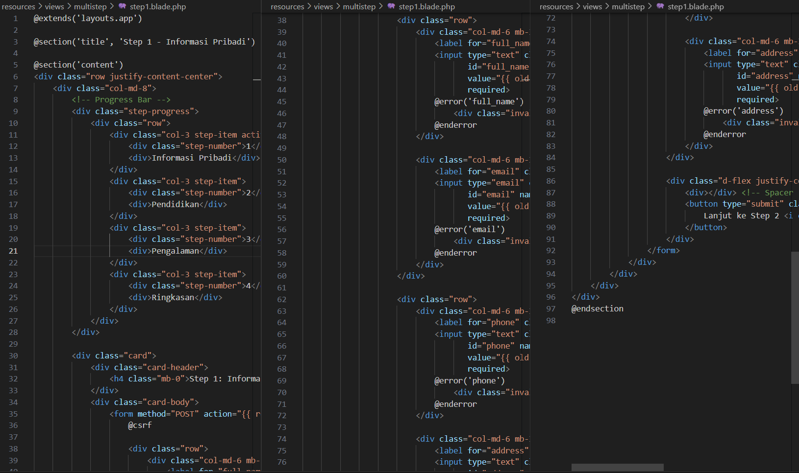
  - Step 2 : informasi pendidikan (resources/views/multistep/step2.blade.php)
    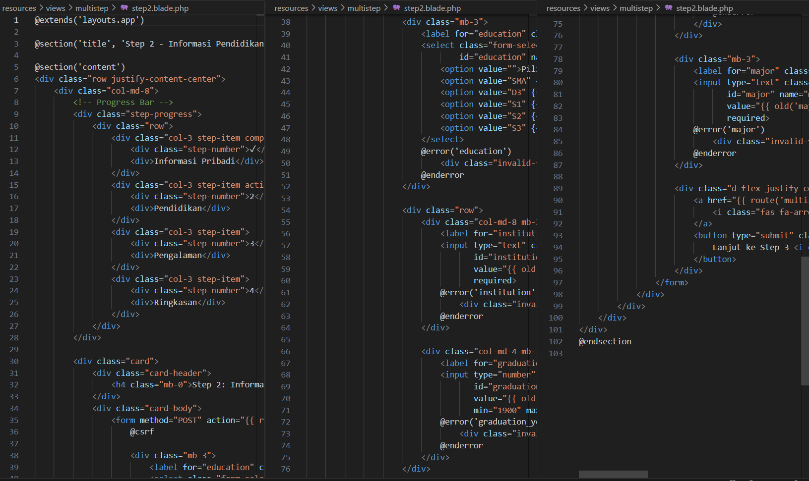
  - Step 3 : pengalaman kerja (resources/views/multistep/step3.blade.php)
    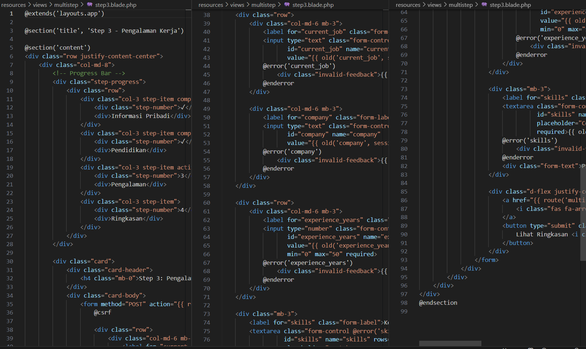
  - Step 4 : Ringkasan (resources/views/multistep/summary.blade.php)
    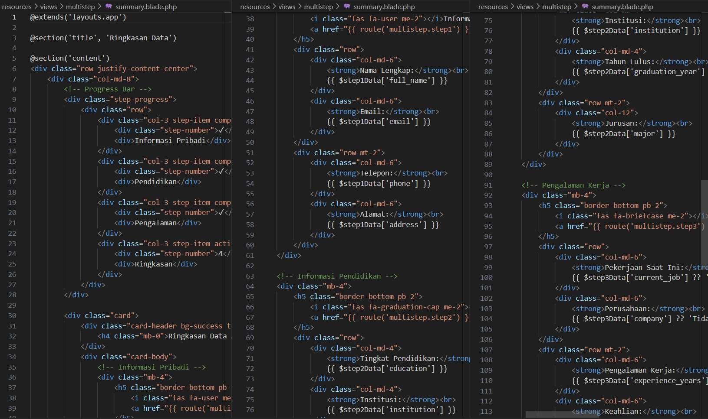
  - Step 5 : Ringkasan (resources/views/multistep/complete.blade.php)
    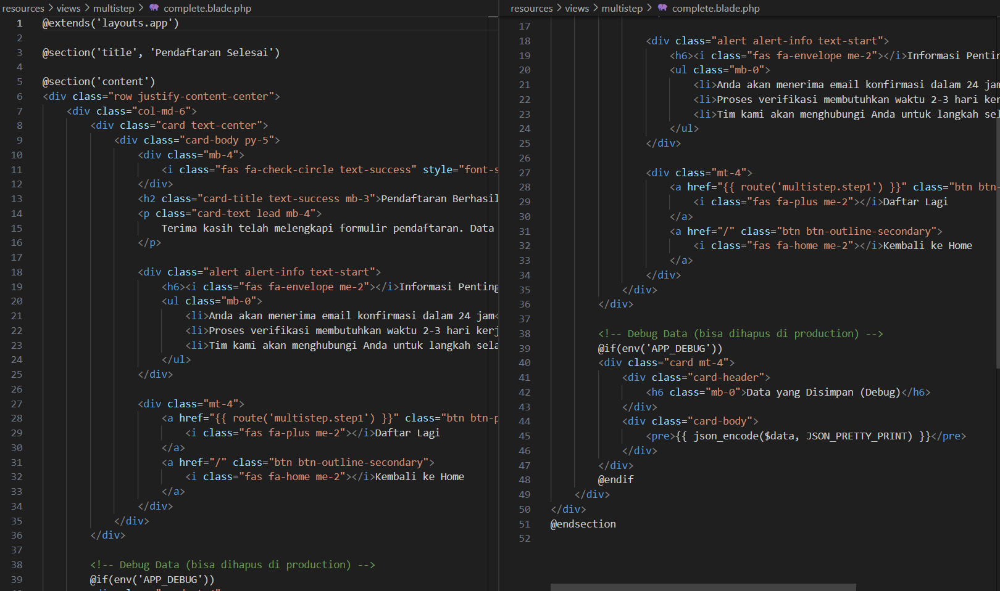  

- Langkah 5: Jalankan Aplikasi
  php artisan serve  
  Buka browser dan kunjungi  
  Admin: http://127.0.0.1:8000/multistep
  dan ikuti step nya hingga halaman complete
  Berikut adalah Hasilnya
  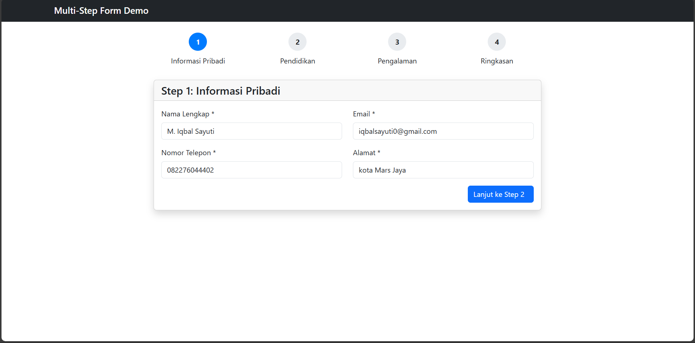
  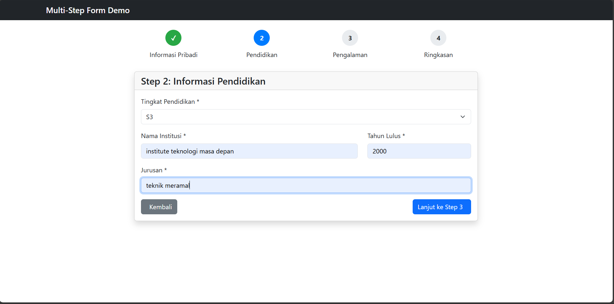
  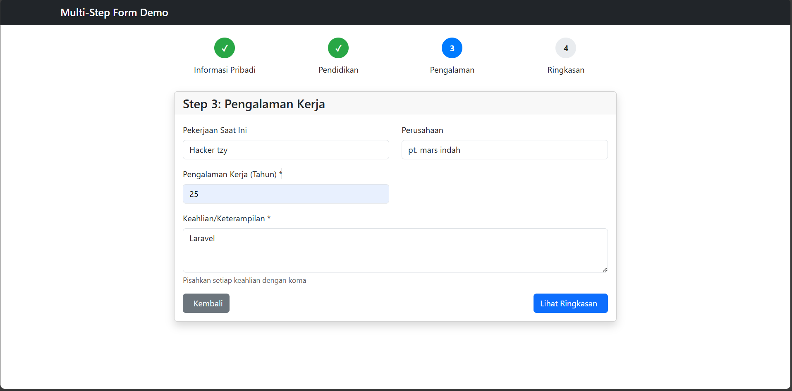
  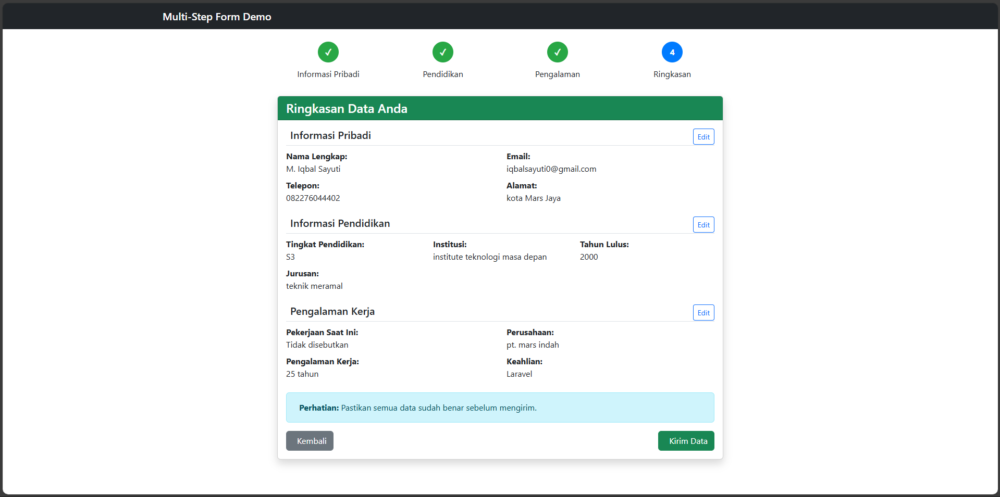
  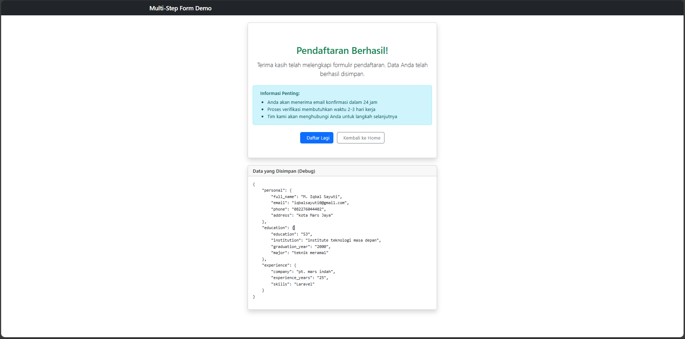

---

## 3. Hasil dan Pembahasan

Pada Praktikum 5 ini, Anda telah berhasil:
- Membangun aplikasi Laravel dengan beberapa halaman (multiple pages).
- Membangun form registrasi dengan berbagai tipe input seperti text, email, number, password, radio button, select dropdown, dan textarea.
- Menerapkan proses form submission menggunakan metode POST untuk pengiriman data yang aman.
- Mengimplementasikan server-side validation dengan Laravel validation rules seperti required, email, numeric, min, dan max
- Membuat validasi kustom dengan pesan error yang lebih informatif dan sesuai konteks.
- Mengarahkan pengguna ke halaman hasil menggunakan redirect setelah form berhasil disubmit.
- Menambahkan progress bar dan tampilan ringkasan akhir untuk pengalaman pengguna yang lebih terstruktur dan intuitif.

Hasil praktikum ini menunjukkan bahwa seluruh komponen form submission, data validation, dan multi-step form dapat diterapkan secara terpadu dalam satu aplikasi Laravel yang aman, interaktif, dan mudah digunakan.

---

## 4. Kesimpulan

Praktikum ini berhasil menunjukkan penerapan konsep form submission dan data validation secara efektif menggunakan Laravel. Validasi server-side memastikan keamanan dan konsistensi data, sementara fitur JavaScript meningkatkan interaktivitas pengguna. Penerapan validasi kustom dan multi-step form membuktikan fleksibilitas Laravel dalam menangani berbagai skenario input data. Secara keseluruhan, sistem yang dibangun berjalan dengan baik, aman, dan memberikan pengalaman pengguna yang nyaman serta efisien.

---

## 5. Referensi
- chatgpt.com
- https://hackmd.io/@mohdrzu/HJWzYp7Reg

---