# Laporan Modul 6: Model dan Laravel Eloquent

**Mata Kuliah:** Workshop Web Lanjut  
**Nama:** M. Iqbal Sayuti  
**NIM:** 2024573010057  
**Kelas:** TI-2C  

---

## Abstrak

Dalam Praktikum ini membahas konsep Model dan penerapan Eloquent ORM pada framework Laravel. Tujuannya adalah untuk memahami cara berinteraksi dengan database menggunakan pendekatan berbasis objek tanpa harus menulis query SQL secara langsung. Dengan menggunakan Eloquent, setiap tabel di database direpresentasikan sebagai model yang memiliki relasi, atribut, dan fungsi manipulasi data sendiri. Praktikum ini juga mendemonstrasikan operasi dasar seperti create, read, update, dan delete (CRUD), serta implementasi relasi antar tabel seperti one-to-many dan many-to-many. Melalui percobaan ini, mahasiswa memahami cara membangun logika bisnis aplikasi yang efisien, terstruktur, dan mudah dikelola dengan memanfaatkan fitur bawaan Laravel.

---

## 1. Dasar Teori

### **Dasar Teori**

Dalam arsitektur MVC (Model–View–Controller), Model berfungsi sebagai penghubung antara aplikasi dan database. Model bertanggung jawab untuk mengelola data, baik dalam hal penyimpanan, pengambilan, maupun pemrosesan logika bisnis.

1. Model Laravel = Kelas yang merepresentasikan tabel di database dan berinteraksi langsung dengan data.
2. Eloquent ORM = Sistem Object-Relational Mapping Laravel yang memungkinkan manipulasi data melalui objek tanpa SQL manual.
3. Konvensi Penamaan = Nama model umumnya singular (misal: User), sedangkan nama tabel plural (users).
4. CRUD Operations = Eloquent menyediakan metode sederhana seperti create(), all(), find(), update(), dan delete().
5. Relasi Antar Model = Mendukung relasi one-to-one, one-to-many, many-to-many, dan hasManyThrough.
6. Mass Assignment Protection = Menggunakan properti $fillable atau $guarded untuk melindungi atribut dari input yang tidak sah.
7. Query Builder Integration = Eloquent dapat dikombinasikan dengan Query Builder untuk operasi data yang lebih kompleks.

---

## 2. Langkah-Langkah Praktikum

Praktikum 1: Menggunakan Model untuk Binding Form dan Display

- Langkah 1: Buat dan Buka Proyek laravel  
  laravel new model-app  
  cd model-app  
  code .

- Langkah 2: Membuat model data sederhana (POCO)  
  Buat ProductViewModel.php di dalam direktori app/ViewModels  
  lalu isi kode :
  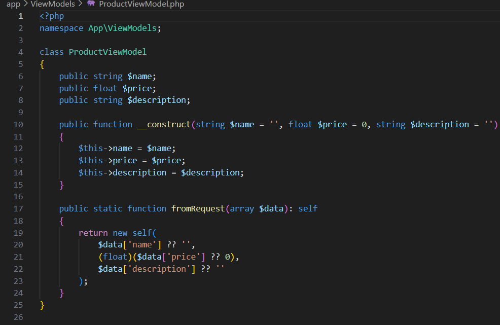

- Langkah 3 : Buat controller  
  `php artisan make:controller ProductConntroller`  
  ini akan membuat app/Http/Controllers/ProductController.php  
  dan isi dengan kode :
  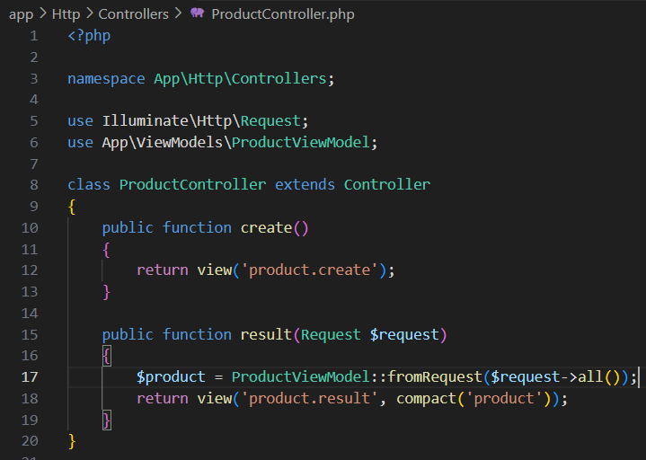

- Langkah 4: Definisikan route  
  Buka Routes/Web.php Dan isi dengan code berikut
  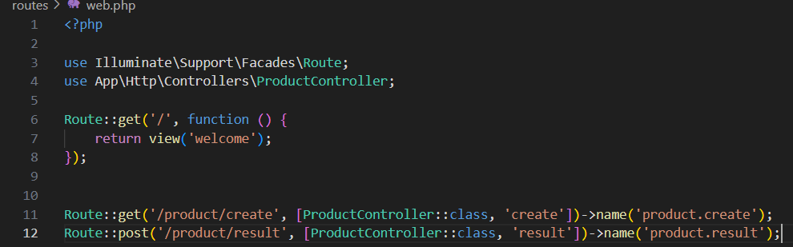

- Langkah 5: Buat Blade View menggunakan bootstrap :
    - Buat File Baru di Direktori resources/views/product/create.blade.php :  
        Isi Dengan Code Berikut
        
    - Buat File Baru di Direktori resources/views/product/result.blade.php :  
        Isi Dengan Code Berikut
        

- Langkah 5: Uji Rute  
  Mulai Php `Artisan serve`  
  Buka Browser Dan Kunjungi  
  http://127.0.0.1:8000/product/create
  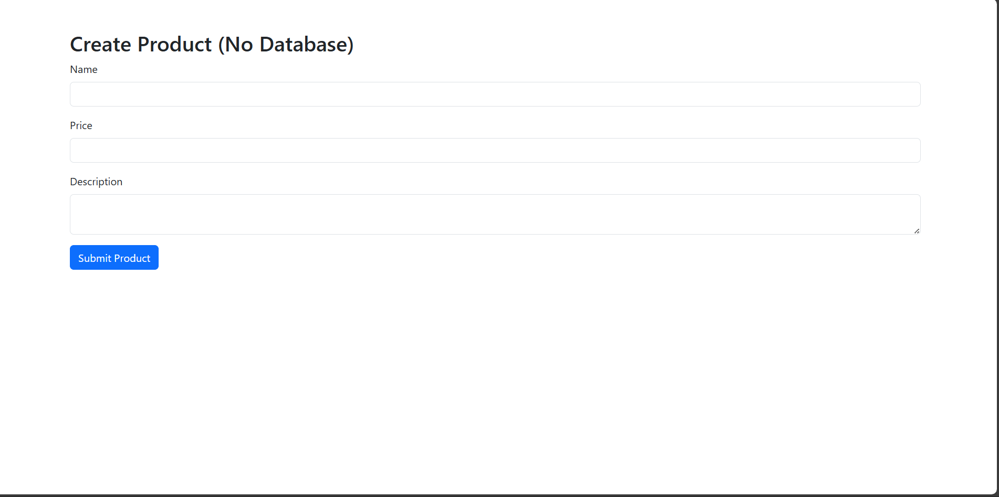

Praktikum 2: Menggunakan DTO (Data Transfer Object)

- Langkah 1: Buat dan Buka Proyek laravel  
  laravel new dto-app  
  cd dto-app  
  code .

- Langkah 2: Buat kelas DTO  
  Buat ProductDTO.php di dalam direktori app/DTO  
  lalu isi kode :
  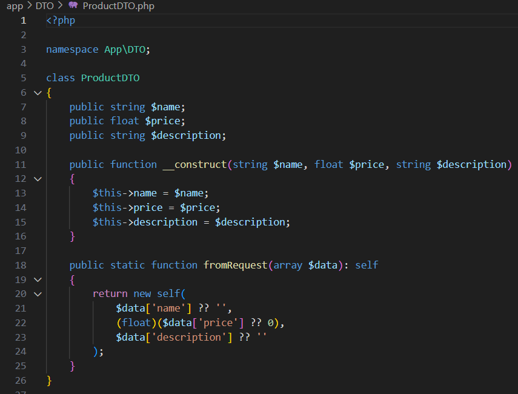

- Langkah 3: Buat service layer  
  Buat ProductService.php di dalam direktori app/Services  
  lalu isi kode :
  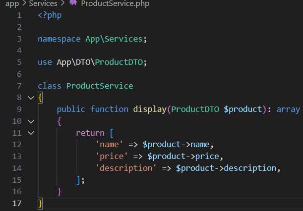

- Langkah 4: Buat Sebuah Controller   
  `php artisan make:controller ProductConntroller`  
  ini akan membuat app/Http/Controllers/ProductController.php.
  lalu isi kode :
  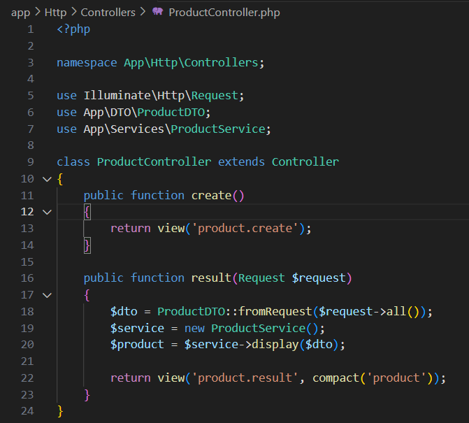

- Langkah 5: Tambahkan route baru  
  Buka routes/web.php dan tambahkan:
  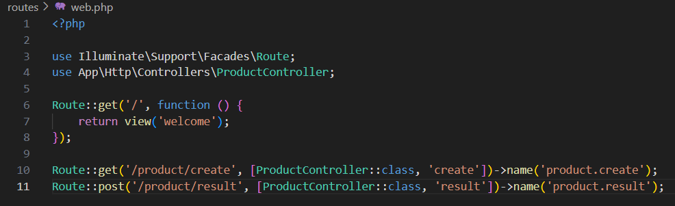      

- Langkah 6: Buat Blade View menggunakan bootstrap :
    - Buat File Baru di Direktori resources/views/product/create.blade.php :  
        Isi Dengan Code Berikut
        
    - Buat File Baru di Direktori resources/views/product/result.blade.php :  
        Isi Dengan Code Berikut
        

- Langkah 7: Jalankan Aplikasi  
  Jalankan Server Pengembangan  
  `php php artisan serve`  
  Akses aplikasi di:  
  http://127.0.0.1:8000/product/create 
  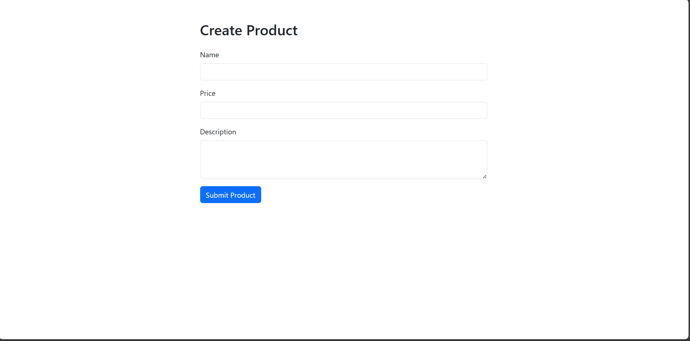

Praktikum 3: Membangun Aplikasi Web Todo Sederhana dengan Laravel 12, Eloquent ORM, dan MySQL 

- Langkah 1: Buat dan Buka Proyek laravel  
  laravel new todo-app-mysql  
  cd todo-app-mysql  
  code .
  - ketika ditanya default migration, maka pilih **NO**
  - Pastikan ekstensi(`extension=mysqli` & `extension=pdo_mysql`) mysql diaktifkan dalam file `php.ini`  

- Langkah 2: Buat database
  hidupkan mysql dan buka cmd dan masuk(cd) ke folder bin kemudian ketik :  
  `mysql -u root -p`  
  `Create database tododb`  

- Langkah 3: install depedency MySQL  
  `composer require doctrine/dbal`

- Langkah 4: Konfigurasi file .env   
  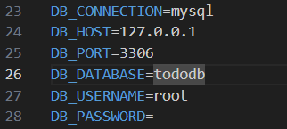  
  Kemudian bersihkan cache  
  `php artisan config:clear`

- Langkah 5: buat migration table todos  
  `php artisan make:migration create_todos_table`  
  buka file baru yg dihasilkan dari perintah diatas dan isi :
  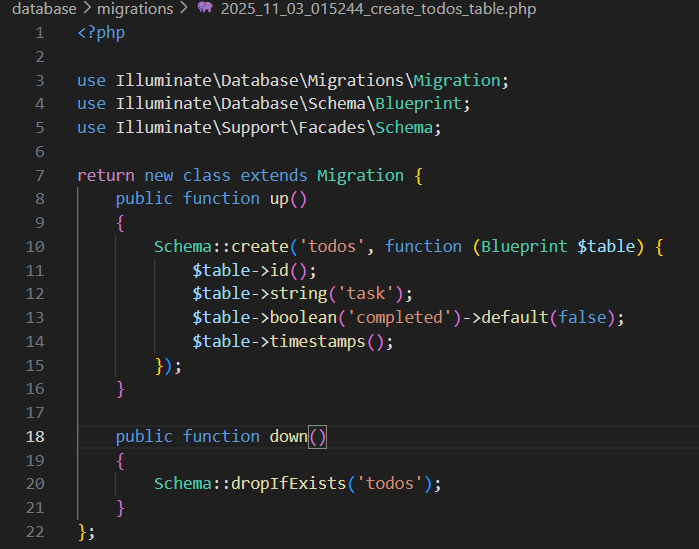  
  Jalankan migrasi  
  `php artisan migrate`

- Langkah 6: buat seeder untuk data dummy  
  `php artisan make:seeder TodoSeeder`  
  buka file yg ada di direktori database/seeders/TodoSeeder.php dan perbarui :  
  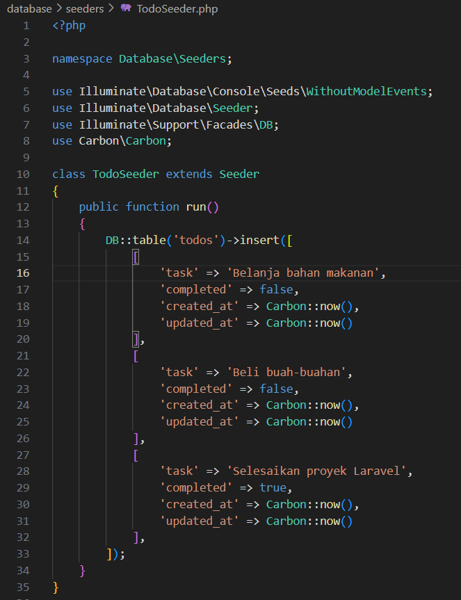  
  Jalankan seeder untuk mengisi database :  
  `php artisan db:seed --class=TodoSeeder`

- Langkah 7: Buat model Todo  
  `php artisan make:model Todo`  
  Buka file dan perbarui  
  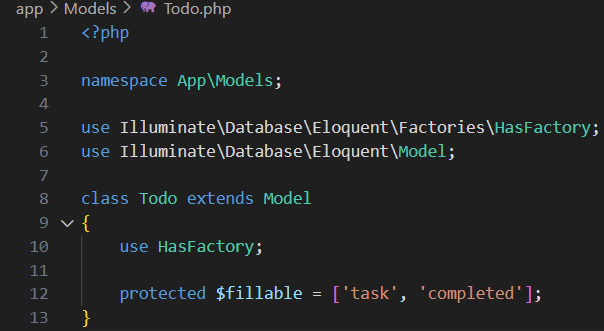

- Langkah 8: Buat TodoController untuk operasi CRUD  
  `php artisan make:controller TodoController`  
  ini akan membuat app/Http/Controllers/TodoController.php   
  dan isikan file nya dengan :  
  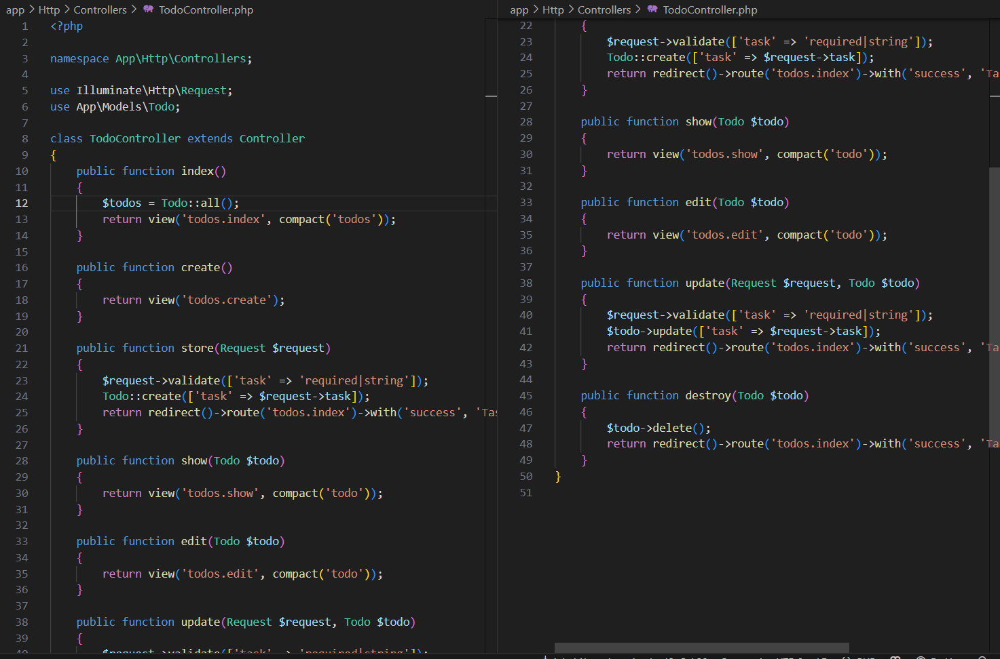

- Langkah 9: Definisikan Route  
  buka route/web.php dan isi:  
  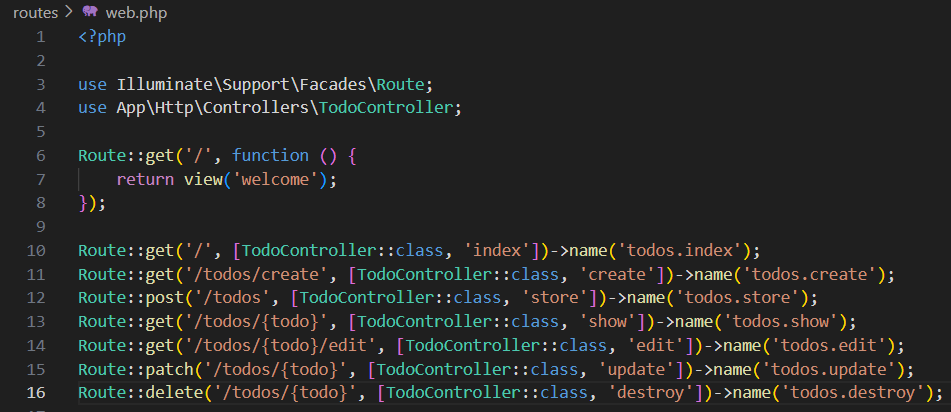

- Langkah 10: Buat layout dasar  
  - Buat direktori layouts di resources/views  
    Kemudian, buat resources/views/admin/app.blade.php:  
    Dan Isi dengan Code Berikut:  
     
  - Buat direktori todos di resources/views
    Kemudian, buat :
    - resources/views/admin/Index.blade.php: 
      dan isi dengan :  
      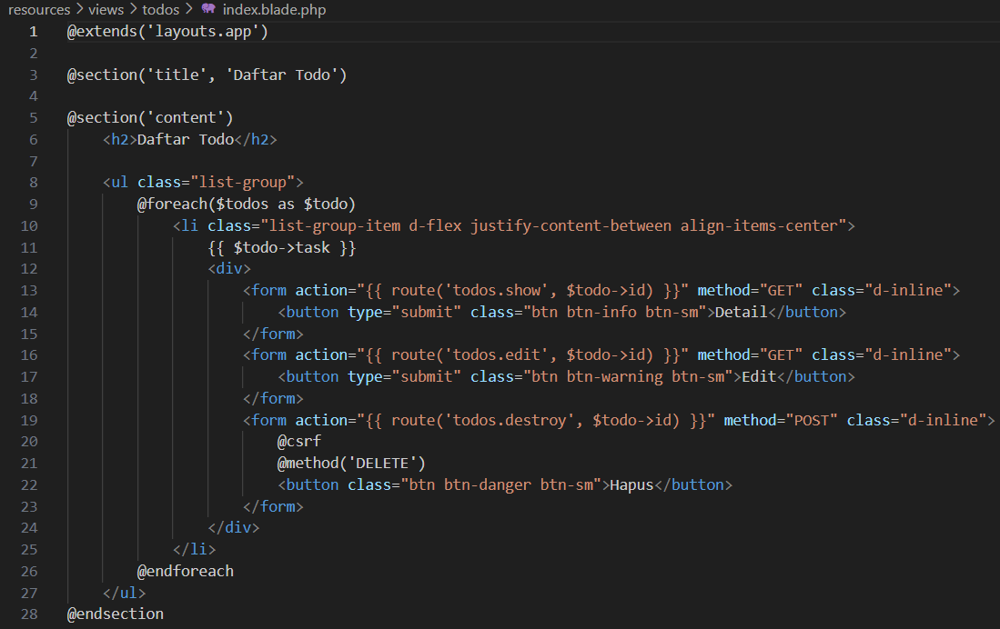  
    - resources/views/admin/Create.blade.php: 
      dan isi dengan :  
      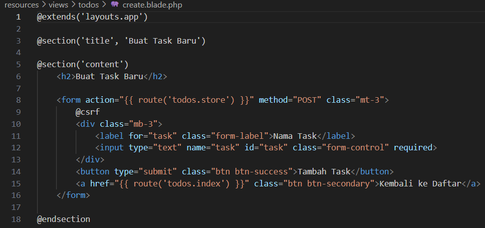  
    - resources/views/admin/Edit.blade.php: 
      dan isi dengan :  
      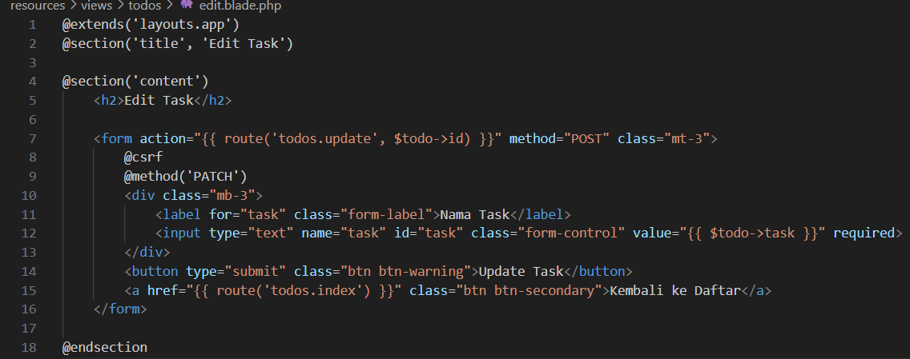  
    - resources/views/admin/Show.blade.php: 
      dan isi dengan :  
      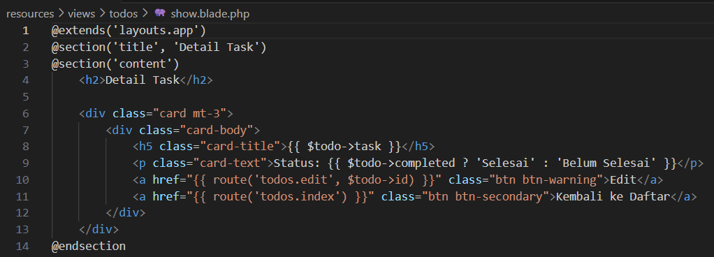  

- Langkah 11: Menguji Aplikasi  
  `php artisan serve`  
  Buka browser dan kunjungi  
  http://127.0.0.1:8000  
  Berikut adalah Hasilnya :
  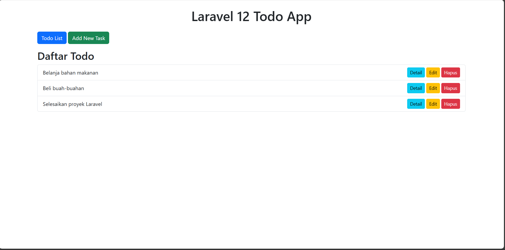
  
  
  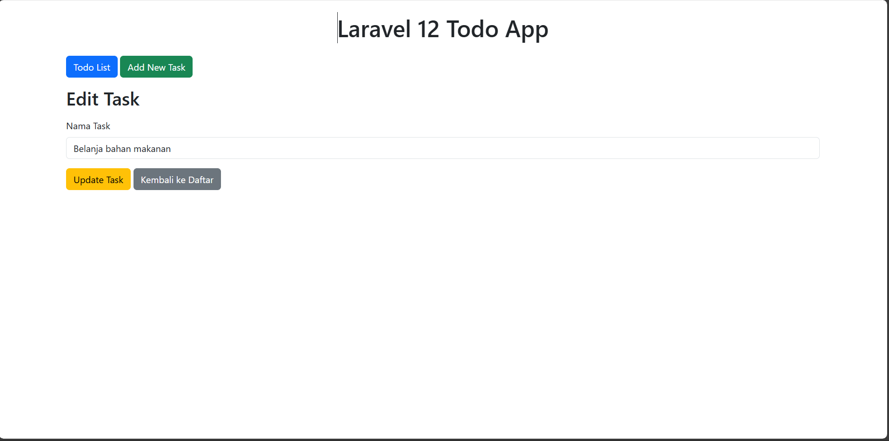
  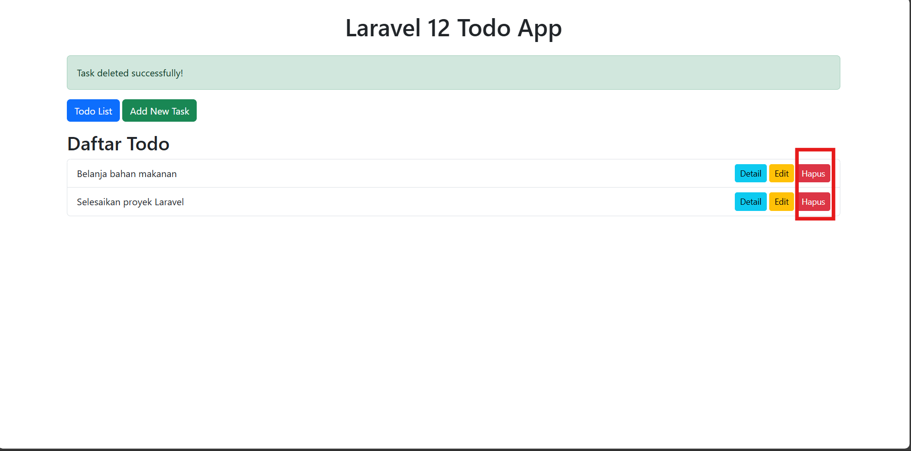
  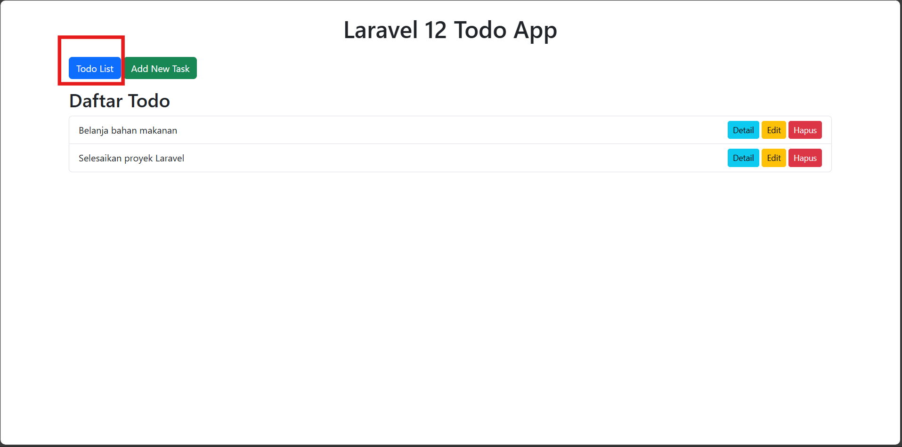

---

## 3. Hasil dan Pembahasan

Pada praktikum 6 ini, Anda telah berhasil:

- Membuat model Laravel menggunakan perintah php artisan make:model.
- Menghubungkan model dengan tabel database melalui konfigurasi otomatis dan konvensi Laravel.
- Menerapkan operasi CRUD menggunakan metode Eloquent seperti create(), find(), update(), dan delete().
- Menambahkan atribut $fillable untuk mengatur kolom yang boleh diisi melalui mass assignment.
- Mengimplementasikan relasi antar model, seperti one-to-many untuk menghubungkan data antar tabel.
- Menampilkan data dari model ke tampilan (view) menggunakan controller.
- Menguji fungsi Eloquent dengan menampilkan hasil query langsung pada halaman web.

Hasil praktikum menunjukkan bahwa penggunaan Model dan Eloquent ORM memudahkan proses pengelolaan data karena sintaksnya sederhana, mudah dibaca, dan tetap efisien tanpa perlu menulis query SQL secara manual.

---

## 4. Kesimpulan

Praktikum ini berhasil menunjukkan penerapan Model dan Eloquent ORM dalam Laravel sebagai solusi efisien untuk mengelola data di database. Eloquent menyederhanakan proses manipulasi data dengan sintaks yang deklaratif dan mendukung berbagai relasi antar tabel. Melalui model, logika bisnis dapat dipisahkan dari tampilan, menjadikan aplikasi lebih terstruktur dan mudah dikembangkan. Dengan demikian, mahasiswa memahami pentingnya konsep Model dalam arsitektur MVC serta keunggulan Eloquent dalam implementasi berbasis objek.

---

## 5. Referensi
- chatgpt.com
- https://hackmd.io/@mohdrzu/HJWzYp7Reg

---