# Laporan Modul 8: Authentication & Authorization

**Mata Kuliah:** Workshop Web Lanjut  
**Nama:** M. Iqbal Sayuti  
**NIM:** 2024573010057  
**Kelas:** TI-2C  

---

## Abstrak

Pada praktikum ini dipelajari penerapan Authentication dan Authorization dalam pengembangan aplikasi Laravel untuk memastikan keamanan akses pengguna. Authentication berfungsi untuk memverifikasi identitas pengguna melalui proses login, registrasi, dan manajemen sesi menggunakan fitur bawaan Laravel seperti Laravel Breeze atau Fortify. Sementara itu, Authorization digunakan untuk mengatur hak akses berdasarkan peran atau izin tertentu melalui mekanisme gates dan policies. Dengan mengimplementasikan kedua konsep tersebut, aplikasi menjadi lebih aman, terstruktur, dan mampu membatasi tindakan pengguna sesuai otorisasi yang telah ditentukan. Praktikum ini memberikan pemahaman dasar mengenai bagaimana mengelola identitas dan kontrol akses sehingga aplikasi dapat berjalan dengan aman dan sesuai standar pengembangan modern.

---

## 1. Dasar Teori

Dalam pengembangan aplikasi berbasis Laravel, Authentication dan Authorization merupakan dua mekanisme penting untuk memastikan keamanan akses pengguna, mulai dari proses verifikasi identitas hingga pemberian hak akses sesuai perannya.

1. Authentication = Proses untuk memverifikasi identitas pengguna sebelum mengakses fitur aplikasi, biasanya melalui login, registrasi, dan manajemen sesi.
2. Laravel Auth System = Menyediakan sistem autentikasi bawaan melalui Breeze, Jetstream, atau Fortify yang menangani proses login, logout, registrasi, dan reset password secara otomatis.
3. Password Hashing = Laravel menggunakan algoritma bcrypt atau argon2 untuk menyimpan password secara aman di database.
4. Middleware auth = Digunakan untuk melindungi rute sehingga hanya pengguna yang sudah terverifikasi yang dapat mengakses halaman tertentu.
5. Session & Token = Setelah login, Laravel membangun sesi atau token untuk mempertahankan status autentikasi pengguna.
6. Authorization = Mekanisme untuk menentukan apakah pengguna yang telah terautentikasi memiliki hak atau izin untuk melakukan suatu aksi dalam aplikasi.
7. Roles & Permissions = Digunakan untuk membedakan tingkat akses pengguna, seperti admin, editor, atau user biasa.
8. Gates = Mekanisme otorisasi sederhana berbasis closure yang digunakan untuk memeriksa izin sebelum suatu tindakan dilakukan.
9. Policies = Kelas khusus yang mengelola aturan akses terhadap model tertentu, seperti izin untuk membuat, mengedit, atau menghapus data.

---

## 2. Langkah-Langkah Praktikum

Praktikum 1: Autentikasi dan Otorisasi dengan Laravel 12 Breeze

- Langkah 1: Buat dan Buka Proyek laravel  
  laravel new auth-lab  
  cd auth-lab  
  code .

- Langkah 2 : Buat database 
  `Create database authlab_db;`  
  Kemudian install depedency MySQL dan setelahnya ubah file .env sesuai nama database  
  `php artisan config:clear`

- Langkah 3 : Instalasi laravel breeze  
  `composer require laravel/breeze --dev`  
  Kemudian, jalankan perintah berikut untk menginstal breeze  
  `php artisan breeze:install`  
  Selama proses instalasi, anda akan diberikan beberapa opsi:  
    - pilih frontend framework : blade  
    - dark mode : pilih yes  
  Lanjutkan dengan langkah ini :  
  `npm install`  
  `php artisan migrate`  

- Langkah 4 : Akses Register and Login via Web Interface
  Jalankan `php artisan serve`  
  dan cek ke http://localhost:8000
  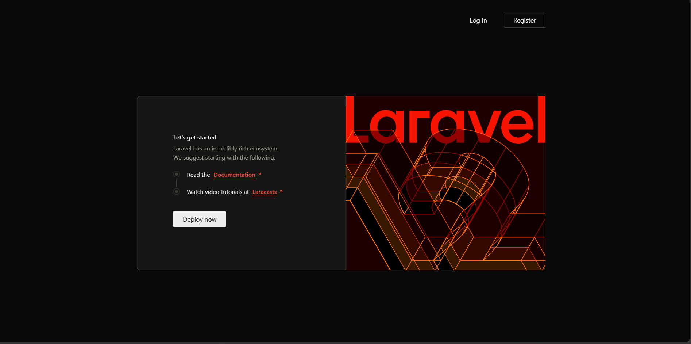

- Langkah 5 : Membuat Rute Profil yang Dilindungi  
  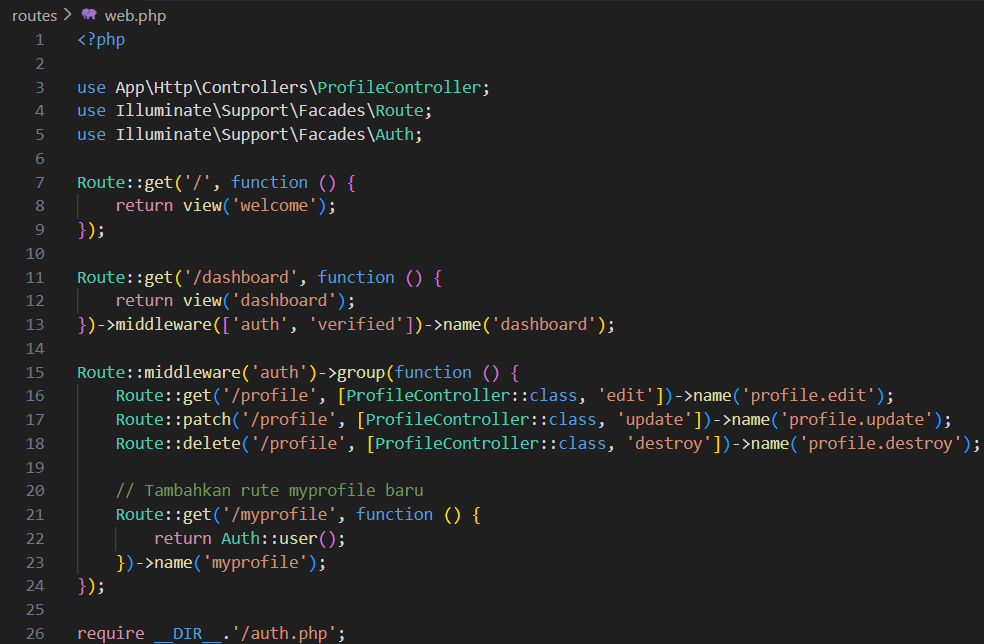  
  Kemudian coba akses ke http://localhost:8000/myprofile  
  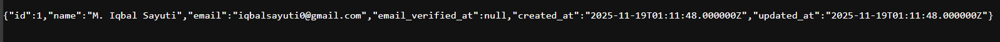  

Praktikum 2: Membatasi Akses Berdasarkan Peran di Laravel 12  

- Langkah 1: Buat dan Buka Proyek laravel  
  laravel new role-lab  
  cd role-lab  
  code .

- Langkah 2: Konfigurasi dan buat database
  Buat database bernama authrole_db dan isikan ke file .env  
  `php artisan config:clear`  

- Langkah 3 : Instalasi Laravel Breeze
  `composer require laravel/breeze --dev`  
  Kemudian jalankan `php artisan breeze:install`  
  sprti tadi, jika ada opsi yg muncul maka kita akan memilih framework blade dan dark mode  
  Jalankan perintah :  
  `npm install`  
  `php artisan migrate`  

- Langkah 4 : Menambahkan Field Role ke Tabel Users  
  Buat migration `php artisan make:migration add_role_to_users_table --table=users`  
  buka file yg migrasi yg telah dibuat dan edit :
  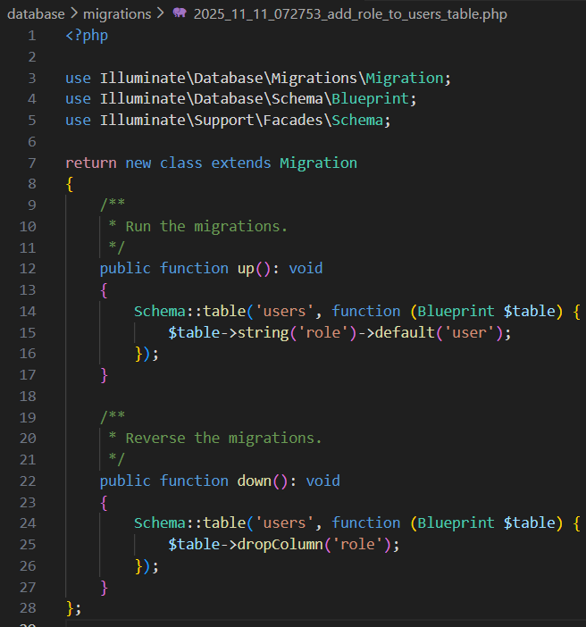  
  dan jalankan `php artisan migrate`  

- Langkah 5 : Seeding Pengguna dengan Peran Berbeda  
  buka dan Edit database/seeders/DatabaseSeeder.php  
  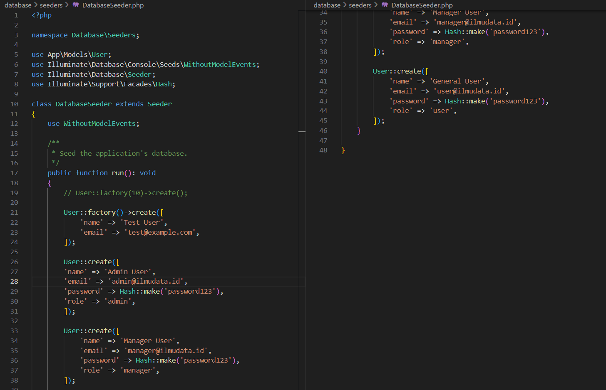  
  Jalankan `php artisan db:seed`  

- Langkah 6 : Membuat Role Middleware  
  Generate middleware : `php artisan make:middleware RoleMiddleware`  
  Kemudian edit :  
  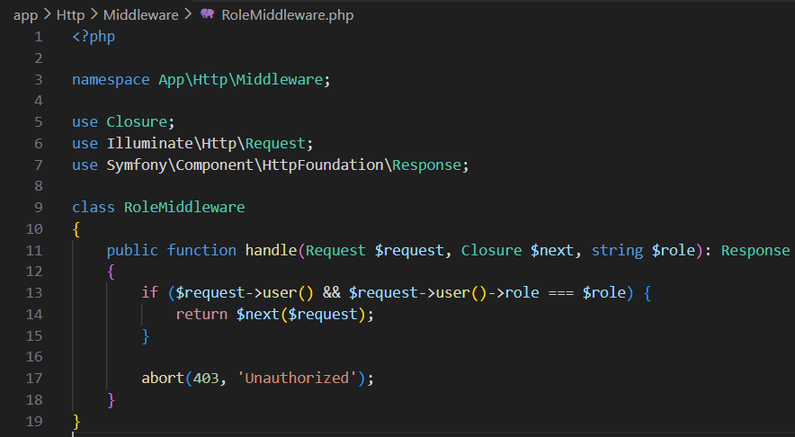  
  Kemudian buka `bootstrap/app.php` dan edit :  
  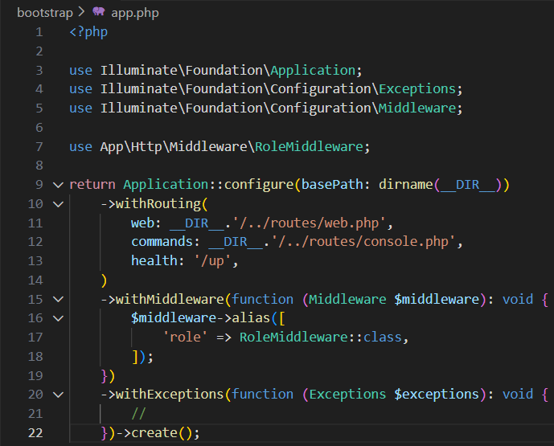

- Langkah 7 : Membuat View untuk Setiap Role  
  - Buat file `admin.blade.php` pada `resources/views/` dan edit :  
    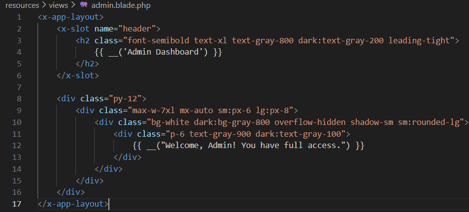  
  - Buat file `Manager.blade.php` pada `resources/views/` dan edit :  
    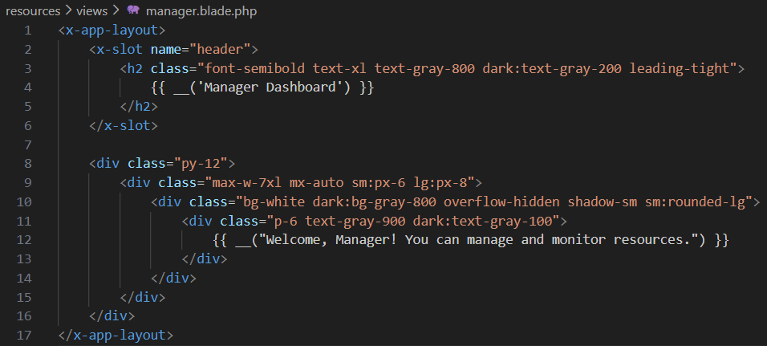  
  - Buat file `User.blade.php` pada `resources/views/` dan edit :  
    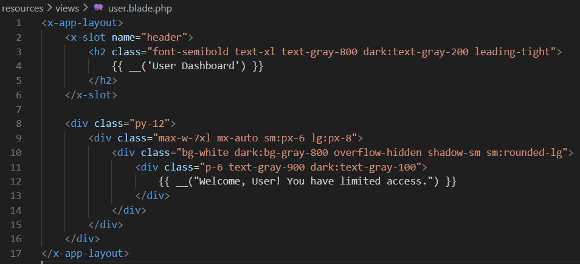  
  - Buat file `all.blade.php` pada `resources/views/` dan edit :  
    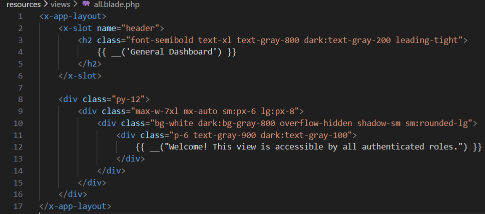  

- Langkah 8 : Mendefinisikan Rute untuk View Berbasis Peran 
  Buka routes/web.php dan tambahkan:  
  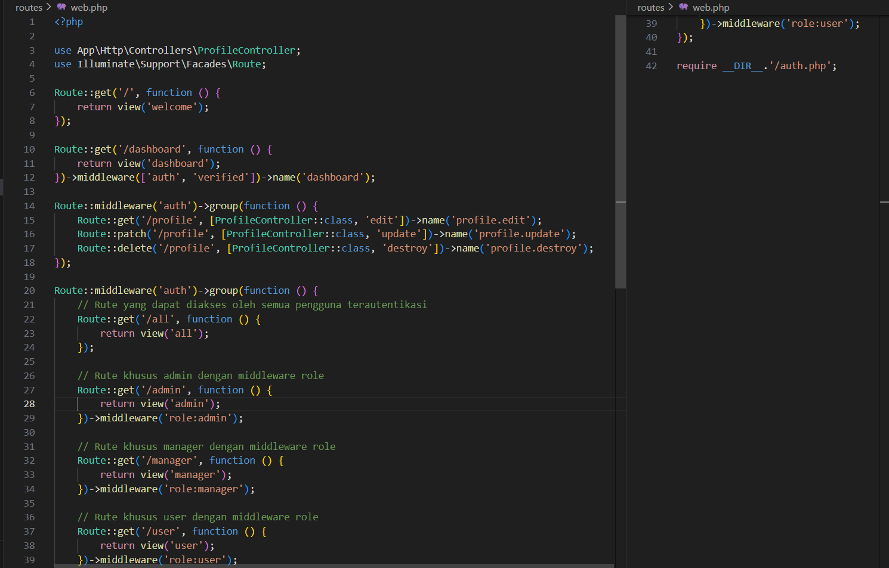  

- Langkah 9 : Jalankan Aplikasi  
  Jalankan `php php artisan serve`  
  Akses aplikasi di:  
  http://127.0.0.1:8000  
  Coba login menggunakan data akun :  
  - Admin: admin@ilmudata.id / password123  
  - Manager: manager@ilmudata.id / password123  
  - User: user@ilmudata.id / password123  
  
---

## 3. Hasil dan Pembahasan

Pada praktikum 8 ini, Anda telah berhasil:

- Mengkonfigurasi sistem Authentication menggunakan Laravel Breeze untuk menyediakan fitur login, registrasi, dan logout secara otomatis.
- Mengamankan halaman tertentu menggunakan middleware auth sehingga hanya pengguna yang sudah login dapat mengakses fitur tertentu.
- Mengimplementasikan Authorization melalui gates dan policies untuk membatasi tindakan pengguna berdasarkan peran atau izin yang telah ditentukan.
- Membuat role atau level akses dasar (misalnya admin dan user) untuk membedakan hak akses pada beberapa fitur aplikasi.
- Menggunakan middleware can untuk memastikan hanya pengguna yang memiliki izin tertentu yang dapat mengakses rute atau melakukan aksi tertentu.
- Menguji hasil autentikasi dan otorisasi dengan mencoba login sebagai berbagai tipe pengguna dan memastikan sistem membatasi akses sesuai aturan.
- Menampilkan feedback kepada pengguna ketika akses ditolak, misalnya melalui pesan error atau redirect ke halaman khusus.

Hasil praktikum menunjukkan bahwa penerapan Authentication dan Authorization pada Laravel secara signifikan meningkatkan keamanan aplikasi dengan memastikan hanya pengguna terverifikasi yang dapat masuk, dan hanya pengguna berizin yang dapat melakukan tindakan tertentu. Integrasi antara autentikasi dan otorisasi membuat sistem menjadi lebih terkontrol, rapi, serta sesuai standar keamanan pengembangan web modern.
 
---

## 4. Kesimpulan

Pada praktikum ini dapat disimpulkan bahwa penerapan Authentication dan Authorization sangat penting untuk menjaga keamanan aplikasi Laravel. Authentication memastikan bahwa hanya pengguna yang terverifikasi yang dapat mengakses sistem, sedangkan Authorization menentukan hak akses setiap pengguna berdasarkan peran atau izin yang telah ditetapkan. Dengan memanfaatkan fitur Laravel seperti Breeze, middleware auth, gates, policies, serta middleware can, proses pengamanan aplikasi dapat dilakukan dengan mudah, terstruktur, dan efisien. Secara keseluruhan, kedua mekanisme ini memungkinkan aplikasi berjalan lebih aman, terkontrol, dan sesuai standar keamanan dalam pengembangan web modern.

---

## 5. Referensi
- chatgpt.com  
- https://hackmd.io/@mohdrzu/BypBawklWg  

---